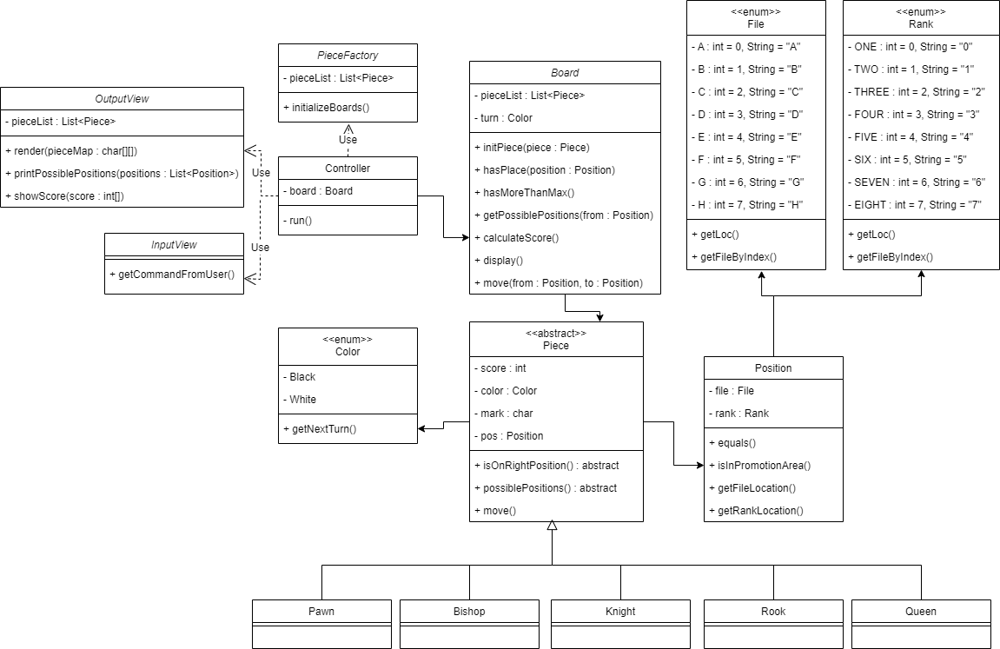
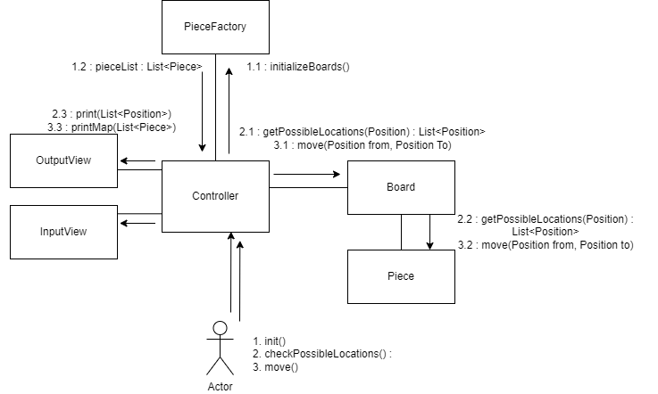

## 메모리 시뮬레이터

### 학습 내용

Heap과 Stack

[Stack]

- Heap 영역에 생성된 Object 타입의 데이터 참조 값(주소)가 할당
- 원시 타입의 데이터가 값과 함께 할당
- 지역 변수는 scope에 따른 visibility
- Thread는 자신만의 stack을 가진다.

[heap]

- 주로 긴 생명주기를 가지는 오브젝트들 저장
- 스레드와 상관없이 단 하나의 heap 영역 존재
- heap 영역에 있는 오브젝트를 가리키는 레퍼런스 변수가 stack에 올라간다.

- new keyword : 생성하려는 오브젝트를 저장할 수 있는 공간이 heap에 있는지 먼저 탐색하여 할당
- Integer, String 등 Immutable Object(불변 객체)는 연산이 수행될 때마다 새로운 오브젝트를 생성한다.
- 불변객체의 값을 바꾸는 행위는 새로운 객체를 생성 후 기존 참조 변수에 재할당하는 행위이다.
- 호출 stack에서 재할당 후 pop되면 새로운 객체를 가리키는 지역 변수가 pop되므로 새 객체는 garbage가 되어 정리된다.
- 불변 객체의 내부 primitive 변수는 private final ~로 선언되어있다. -> 불변 객체

Garbage Collection의 원리

- JVM 가비지 컬렉터가 힙에 할당된 불필요한 메모리(가비지)를 정리
- 스택에서 더 이상 힙의 객체를 참조하지 않는 경우(Unreachable) 가비지가 된다.
    - Unreachable : 스택에서 도달할 수 없는 heap의 객체

[Minor GC와  Major GC]

JVM의 객체는 대부분 일회성으로 생겼다가 해제되므로 장기/단기에 따라 Young, Old로 구분하여 Heap 영역이 설계되었다.
그리고, 오래된 객체는 새로운 객체를 참조할 일이 거의 없다.

- Young Generation
    - 새롭게 생성된 객체가 할당(Allocation)되는 영역
    - 대부분 객체가 접근 불가능한 상태가 된다.
    - Young 영역의 GC를 Minor GC라고 한다.
- Old Generation
    - Young 영역에서 Reachable을 오래 유지하는 객체를 Old Generation 영역으로 Promotion한다.
    - 크게 할당되며, 큰 만큼 가비지가 적게 발생한다.
    - Old 영역의 GC를 Full GC/Major GC라고 한다.

Old 영역은 즉 수명이 긴 객체들, Young은 주기가 짧고 많은 공간을 필요로하지 않는 객체들이 저장되는 공간.
Young 영역의 객체를 참조할 경우를 대비한 512 bytes의 카드 테이블이 존재. Minor GC를 수행할 때, Old 영역이 참조하고 있는지를 모두 확인해야하는데,
비효율적이므로 카드 테이블만 조회해 GC 대상인지 아닌지를 식별함.

[Garbage Collection의 동작 방식]

세부 사항은 다르지만 크게 2가지 공통 단계가 있다.

1. Stop the World

- GC를 실행하기 위해 JVM이 실행을 멈추는 단계. 모든 쓰레드의 작업 중단, GC 완료 후 재개된다.
- GC 성능 개선 = 멈춤 시간 감소

2. Mark and Sweep
    - Mark : 사용/비사용 메모리 구분
    - Sweep : 비사용 메모리 해제

[Minor GC의 동작]

- Young 영역의 구조
    - Eden 영역 : 객체가 Allocation되는 영역
    - Survivor 영역 : 최소 1번의 GC 이상 살아남은 객체가 존재하는 영역 (2단계)

- Minor GC는 Eden 영역이 꽉 찰 때 발생한다.
- Eden 영역에서 해제되지 않은 메모리는 하나의 Survivor 영역으로 옮겨진다.
- Survivor 영역이 가득차면 객체들을 다른 Survivor 영역으로 옮긴다.
- 오래살아남은 객체는 Old 영역으로 이동(Promotion)된다.
    - 객체의 생존 횟수를 의미하는 age를 Object header에 기록하여, age에 따라 promotion을 결정한다.

[Major GC의 동작]

- 객체들의 promotion으로 old memory가 부족해질 때 발생
- 메모리 용량이 크기 때문에 10배이상 시간 소요, minor 영역도 참조를 확인해야하므로 시간이 많이 걸린다.

[Garbage Collector 종류]

1. Serial GC

- Minor, MajorGC가 순처작 시행
- Mark-Compact Collection Method 사용
    - 빠른 새로운 메모리 할당을 위해 기존 메모리의 오브젝트를 힙의 시작위치로 옮겨놓는 방법
    - 창고 물건을 버리고 물건을 다시 차곡차곡 쌓아두는 것과 유사

2. Parallel GC
    - Young Generation에 대한 GC를 멀티스레드를 사용해 수행
3. Concurrent Mark Sweep(CMS) Collector
    - Low Pause Time이 목적
    - Major GC에 대해서도 Multi Threading한다는 것이 Parallel과 차이점
    - Young Gen.에 대한 GC 수행 시 Parallel GC와 같은 알고리즘을 쓰지만, compact 작업이 없어 메모리 파편화가 문제가 될 수 있다.
4. G1 Garbage Collector
    - 빠른 처리 속도, STW 최소화, CMS GC보다 효율적으로 App과 GC 진행 가능, 메모리 Compaction 지원
    - 자바 9 이후 기본 GC 방식

### 기능 요구사항

- [ ] 프로세스 메모리 구조를 다루는 프로그램이라서 메모리 주소를 값으로 다루는 포인터 변수를 직접 구현해야 한다.
- [ ] 프로그램에서 처리하는 모든 포인터 메모리 사이즈는 4바이트를 기준으로 한다.
- [ ] 프로그래밍 요구사항 에 나와있는 함수들을 구현한다.
- [ ] 각 함수 동작을 확인하기 위해 특정한 시나리오대로 동작하는 프로그램을 별도 파일로 작성한다.
- [ ] 다양한 경우에 대한 동작을 확인하기 위한 시나리오 흐름은 스스로 결정한다.
- [ ] 아래 함수 내부에서 출력하지말고, 함수에서 return 한 값을 호출한 프로그램에서 출력한다.

### 프로그래밍 요구사항

- 매개변수나 리턴에 필요한 타입은 스스로 판단해서 선언한다.
- 리턴 명세가 있는 경우는 반드시 리턴하도록 구현한다.
- [ ] 스택 동작을 담당하는 Stack 타입도 별도로 선언하고, 내부에는 Stack Pointer변수를 두고 몇 번째까지 쌓였는지 확인하도록 한다.

1. init(stackSize, heapSize)

- 스택영역 크기와 힙영역 크기를 지정하면 프로세스 공간을 위한 기본 주소(base address)를 리턴한다.
- 이번 미션에서는 일반적인 프로세스 메모리 모델(배경 지식 참조)중에서 스택과 힙 영역을 위주로 구현한다. 다른 영역은 무시한다.
- 아래 함수들에서 사용하는 포인터 주소들은 이 함수에서 리턴하는 기본 주소에서 얼마나 떨어진지 상대 주소로 표현한다.

2. setSize(type, length)

- type 별로 고유한 사이즈를 가지도록 등록한다.
  예시 : setSize("int", 8) //int 타입을 8바이트 길이로 지정한다.
- 메모리 시뮬레이션을 위해 스스로 필요한 타입을 지정해야 한다.
- 이미 등록한 타입은 다시 사이즈를 바꿀 수 없다.
- 사이즈는 1,2,4,8,16,32 중에 하나만 가능하다.

3. malloc(type, count)

- 이미 등록된 type에 대해 count만큼 반복해서 메모리를 할당하고 시작 위치 고유한 주소를 스택 영역에 추가하고, 스택 주소값을 리턴한다.
- 만약 해당 타입 크기가 8바이트 보다 작은 경우는 패딩을 붙여서 8바이트로 만든 후, count만큼 반복한다.
- 예를 들어 boolean 타입을 1로 등록했고 malloc("boolean", 4)를 호출한다면 패딩을 붙여서 8바이트 단위로 4개 = 총 32바이트를 할당한다.

4. free(pointer)

- malloc 할 때 할당했던 스택 주소값을 입력으로 받는다. 스택 주소값에 있는 힙영역 고유 주소를 찾아서 해제하고 반환한다.

5. call(name, paramCount)

- 마지막 스택 위치를 알려주는 스택 포인터에 포인터 변수를 paramCount만큼 반복해서 생성하고 스택 포인터를 증가시킨다.
- paramCount는 0부터 10이하 값이다.
- name은 최대 8자까지만 가능하다.
- call 실행할 때마다 name값을 스택에 기록하고 아래 callstack()에서 활용한다.

6. returnFrom(name)

- 증가했던 스택 공간을 비우고 이전 호출 위치로 이동한다.
- 이 때 name값은 call() 호출로 가장 최근에 호출한 name과 동일해야 한다.

가장 최근보다 이전에 호출한 name이면 에러값을 throw 한다.

만약 call() 호출 이후에 malloc()으로 생성한 stack 영역에 포인터 값이 있다면 같이 비운다.

단, malloc()으로 생성된 힙 영역의 메모리는 free()할 수 없고 스택에 있던 포인터 변수만 삭제한다.

call()을 호출한 경우가 없을 경우 아무런 동작을 하지 않는다.

7. usage()
   스택 영역 전체크기, 사용중인 용량, 남은 용량, 힙 영역 전체크기, 사용중인 용량, 남은 용량을 순서대로 배열로 리턴한다.

8. callstack()
   현재 스택에 쌓여있는 호출 스택을 문자열로 리턴한다.

출력하는 스택 포인터는 base address + offset address 형태로 표현한다

예를 들어 call("foo", 0), call("bar", 1), call("dap", 2) 순서로 호출한 경우는 foo() 0xAF00 -> bar() 0xB100 ->
dap() 0xBF00 형태로 함수 이름과 스택의 주소를 리턴한다.

그 후에 returnFrom("dap") 호출한 경우는 foo() 0xAF00 -> bar() 0xB100 형태로 dap을 리턴하고 남은 함수 이름과 스택의 주소를 리턴한다.

9. heapdump()
   힙영역에서 사용중인 상태를 문자열 배열로 표현해서 리턴한다.

힙 영역에 정보는 타입과 크기, 해당 주소를 참조하는 스택 포인터 변수 정보도 포함한다.

모든 포인터 주소값은 base address + offset address 형태로 표현한다

10. garbageCollect()
    힙영역에 할당된 타입들 중에서 스택에 포인터 변수가 없는 경우를 찾아서 해제하는 동작을 한다.

11. reset()
    모든 stack과 heap 공간을 비우고 init했을 때와 동일하게 초기상태로 만든다.