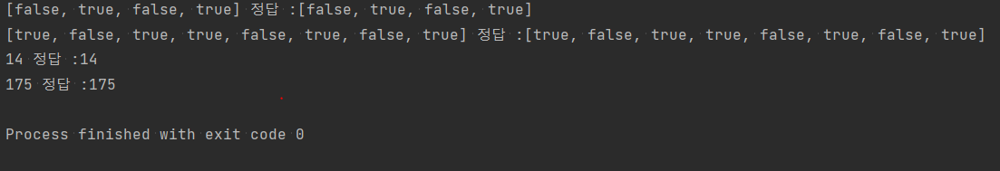

## 미션 1 - 개발 환경

### 기능요구사항

- [O] 단계를 진행하면서 작업한 명령어, 스크린 캡처, 진행 과정, 실행 결과를 체크리스트를 채울때마다 README.md에 마크다운 문법으로 업데이트한다.

- [O] 소스 파일, 문서와 이미지 등을 모두 포함해서 secret gist에 저장한다.

  - [O] 단, 컴파일한 바이너리 실행 파일은 포함하지 않는다.

#### 1.dec2bin() 함수
- 0부터 256 미만의 Int 정수형 10진수를 [Bool] 2진수 배열로 변환하는 dex2bin 함수를 구현한다.
- 기본 연산만으로 변환하는 방식을 구현한다
  - 기존에 진법변환 함수나 라이브러리를 사용하지 않는다
- 만들어지는 비트 순서는 낮은 자리가 배열의 앞쪽에 오도록 표현한다. 배열의 순서대로 보면 이진수가 뒤집혀 있는 것처럼 보인다고 가정한다.

- 이진수 1100 = [ false, false, true, true ], 이진수 0101 = [ true, false, true, false ]

#### 2.bin2dec() 함수
[Bool] 2진수 배열을 Int 정수형 10진수로 변환하는 bin2dec 함수를 구현한다.

- 기본 연산만으로 변환하는 방식을 구현한다.
- 입력하는 비트 순서는 낮은 자리가 배열의 앞쪽에 오도록 표현한다. 배열의 순서대로 보면 이진수가 뒤집혀 있는 것처럼 보인다고 가정한다.

- 이진수 1100 = [ false, false, true, true ] 이진수 0101 = [ true, false, true, false ]

### 프로그래밍 요구사항
- [ ] 값을 변환하는 함수를 선언하고, 변환할 값을 전달하는 상위 함수와 변환한 값을 출력하는 함수를 분리해서 작성한다.

### 구현 과정
1. dec2bin 함수
   - 반복문과 나머지 연산을 활용하여 ArrayList에 변환 결과를 저장한다.
   - 함수 시그니쳐에 맞게 배열에 결과를 반환한다.
2. bin2dec 함수
   - Math라이브러리의 pow함수로 반복적으로 더해 변환한 결과를 반환한다.

### 구현 결과

