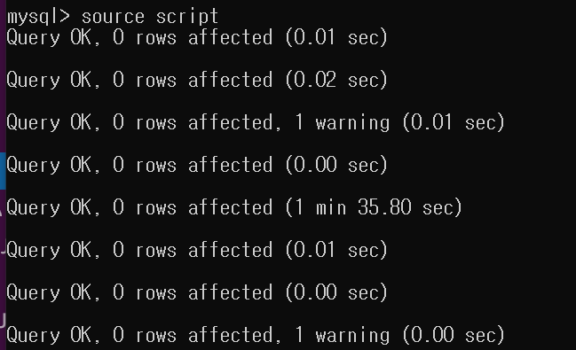

### OSI 7 계층

- 네트워크 통신이 일어나는 과정을 7단계로 나눈 네트워크 표준 모델
- 송신 시에는 응용 계층에서부터 헤더를 붙이게 되고, 수신 시에는 역순으로 헤더를 분석한다.

1. 1계층 - 물리계층
주로 전기적, 기계적, 기능적 특성으로 통신 케이블로 데이터를 전송하는 물리적인 장비
통신 단위는 Bit로 on/off만 표현한다.
통신 케이블, 리피터, 허브 등의 장비가 사용된다.
2. 2계층 - 데이터 링크 계층
물리계층을 통해 송수신되는 정보의 오류와 흐름을 관리하여 안전한 통신 흐름 관리
프레임에 물리적 주소(MAC Address)를 부여하고 에러검출, 재전송, 흐름제어 수행
전송 단위는 Frame이다.
3. 3계층 - 네트워크 계층
데이터를 목적지까지 안전하고 빠르게 전달
Router를 통해 경로를 선택, 목적지 주소를 정한다(IP). -> IP 헤더 추가
패킷 단위로 전송
장비 : 라우터
4. 4계층 - 전송 계층
Port 번호, 전송방식(TCP/UDP) 결정 -> 보통 TCP 헤더 붙음
두 지점 간 신뢰성 있는 데이터를 주고 받게 해주는 역할
에러, 경로 제어
TCP에서는 세그먼트 단위로 전송된다.
5. 5계층 - 세션 계층
주 지점 간의 프로세스 및 통신하는 호스트 간의 연결 유지
TCP/IP 세션 체결, 포트 번호를 기반으로 통신 세션 구성
API, Socket
6. 6계층 - 표현 계층
전송하는 데이터의 표현방식을 결정
파일 인코딩, 압축, 암호화 등
7. 7계층 - 응용 계층
최종 목적지로, 일반적인 응용 서비스 수행


### OSI 7계층, TCP/IP 4계층

|OSI 모델계층| 역할                  |TCP/IP 모델 계층|
|---------|---------------------|------------|
|7. 응용 계층| 응용 프로그램에서 사용하는 프로토콜 |4. 응용 계층|
|6. 표현 계층| 데이터 표현과 암호화         ||
|5. 세션 계층| 	세션 관리              ||
|4. 전송 계층| 데이터 전송의 신뢰성 보장	     | 3. 전송 계층            |
|3. 네트워크 계층|데이터 패킷 라우팅|2. 인터넷 계층|
|2. 데이터 링크 계층|물리적 매체를 통한 데이터 전송과 오류 검출|1. 네트워크 인터페이스 계층|
|1. 물리 계층|물리적 매체와 전기적 특성|

### TCP란?
인터넷상에서 데이터를 메세지의 형태로 보내기 위해 IP와 함께 사용하는 프로토콜로, 전송을 제어하는 규약이다.

IP는 데이터의 배달을 처리하는 프로토콜, TCP는 패킷을 추적 관리하는 프로토콜이라고 볼 수 있다.
패킷 ? : 데이터를 보내기 위한 라우팅을 효율적으로 하기 위해서 데이터를 여러 조각으로 나누어 전송하는데, 단위를 패킷이라고 한다.
패킷의 추적 관리 : TCP 헤더의 Sequence Number를 기준으로 도착 후에 패킷을 순서대로 재조립하면서 관리한다.


### TCP의 특징
- 연결 지향 방식이다.
- 3-way handshaking과정을 통해 연결을 설정하고 4-way handshaking을 통해 해제한다.
- 흐름 제어 및 혼잡 제어.
- 높은 신뢰성을 보장한다.
- UDP보다 속도가 느리다.
- 전이중(Full-Duplex), 점대점(Point to Point) 방식.

### TCP 헤더 구조

- Source Port : 송신측의 포트 번호
- Destination Port : 수신측의 포트 번호


- Sequence Number : 전송된 데이터의 순서 번호
네트워크가 불안하여 패킷을 분실하거나 지연으로 순서가 어긋날 수 있기 때문에 sequence number로 데이터를 재배열할 수 있습니다.
- Acknowledgment Number : 수신한 데이터의 순서 번호를 확인하기 위한 응답 번호
다음 세그먼트를 수신할 준비가 되었다는 사실을 알립니다.
모든 데이터가 수신되었다는 것을 나타내는 묵시적 확인 메시지 역할을 합니다.
- Data Offset : 헤더의 길이를 나타냅니다.
- Reserved : 예약 필드로, 0으로 설정됩니다.
- Flags : TCP의 특성을 지정하는 6개의 플래그(bit)로, SYN, ACK, FIN 등이 포함됩니다.
  - ACK(Acknowledgment) : 확인 응답 메시지
  - SYN(Synchronize) : 가상 회선이 처음 개설될 때 두 시스템의 TCP 소프트웨어는 의미 있는 확인 메시지를 전송하기 위해 일련 번호를 서로 동기화해야 한다.
  - FIN(Finish) : 작업이 끝나고 가상 회선을 종결하고자 할 때 사용
- Window : 송신측이 전송할 수 있는 수신 버퍼의 크기를 나타낸다.
- Checksum : 데이터의 무결성을 검사하는 체크섬 값
- Urgent Pointer : 긴급한 데이터가 전송될 경우 지정되는 필드입니다.
- Options : TCP 헤더의 옵션을 설정할 수 있는 필드입니다.
- Padding : 옵션 필드의 크기가 일정 크기보다 작을 경우 채워집니다.

```
 0                   1                   2                   3   
 0 1 2 3 4 5 6 7 8 9 0 1 2 3 4 5 6 7 8 9 0 1 2 3 4 5 6 7 8 9 0 1
+-+-+-+-+-+-+-+-+-+-+-+-+-+-+-+-+-+-+-+-+-+-+-+-+-+-+-+-+-+-+-+-+
|          Source Port          |       Destination Port        |
+-+-+-+-+-+-+-+-+-+-+-+-+-+-+-+-+-+-+-+-+-+-+-+-+-+-+-+-+-+-+-+-+
|                        Sequence Number                        |
+-+-+-+-+-+-+-+-+-+-+-+-+-+-+-+-+-+-+-+-+-+-+-+-+-+-+-+-+-+-+-+-+
|                    Acknowledgment Number                      |
+-+-+-+-+-+-+-+-+-+-+-+-+-+-+-+-+-+-+-+-+-+-+-+-+-+-+-+-+-+-+-+-+
|  Data |         |E|U|A|P|R|S|F|                               |
| Offset|Reserved |C|R|C|S|S|Y|I|            Window             |
|       |         |E|G|K|H|T|N|N|                               |
+-+-+-+-+-+-+-+-+-+-+-+-+-+-+-+-+-+-+-+-+-+-+-+-+-+-+-+-+-+-+-+-+
|           Checksum            |         Urgent Pointer        |
+-+-+-+-+-+-+-+-+-+-+-+-+-+-+-+-+-+-+-+-+-+-+-+-+-+-+-+-+-+-+-+-+
|                    Options                    |    Padding    |
+-+-+-+-+-+-+-+-+-+-+-+-+-+-+-+-+-+-+-+-+-+-+-+-+-+-+-+-+-+-+-+-+

```


### TCP 3-way Handshake / 4-way Handshake


- TCP 3-way Handshake는 통신 데이터 전송 전에 정확한 전송을 보장하기 위해 상대방 컴퓨터와 사전 세션 수립 과정을 의미
- SYN : synchronize sequence numbers
- ACK : acknowledgement
- 양쪽 모두 상대편에 대한 초기 순차 일련번호를 얻을 수 있도록 한다.

1. 클라이언트는 서버에 접속 요청하는 SYN 패킷을 보낸다.
클라이언트 - SYN_SENT 상태
서버 - Wait for Client 상태
2. 서버는 SYN 요청을 받고 클라이언트에게 요청을 수락한다는 ACK + SYN 패킷을 발송한다.
서버 - SYN_RECEIVED 상태
3. 클라이언트는 서버에게 다시 ACK을 보내고 연결이 이루어진다.
클라이언트, 서버 - ESTABLISHED

- TCP 4-way Handshake는 세션을 종료하기 위한 절차
1. 클라이언트가 연결 종료하겠다는 FIN 플래그 전송
클라이언트 - FIN-WAIT 상태
2. 서버는 FIN 플래그를 받고, ACK을 보내고 자신의 통신이 끝날 때까지 기다린다.
서버 - CLOSE-WAIT 상태
3. 연결 종료 준비가 되면, 연결 해지를 위한 준비가 되었음을 알리기 위해, 클라이언트에게 FIN 플래그를 보낸다.
서버 - LAST-ACK 상태
4. 클라이언트는 해지 준비가 되었다는 ACK을 확인했다는 메시지를 보낸다.
클라이언트 상태 - FIN-WAIT -> TIME-WAIT 변경
5. 클라이언트는 잉여 패킷을 기다리는 과정을 거치는데, 이를 TIME-WAIT이라고 한다. 일정 시간 후에 세션을 만료하고 연결을 종료시킨다.
Server에서 FIN을 전송하기 전에 전송한 패킷이 Routing 지연이나 패킷 유실로 인한 재전송 등으로 인해 FIN패킷보다 늦게 도착하는 상황
클라이언트 상태 - TIME-WAIT -> CLOSE

### UDP?
데이터를 데이터그램 단위로 처리하는 프로토콜을 의미한다. 데이터그램은 독립적인 관계를 지니는 패킷이라는 의미이다.
TCP와 다르게 논리적인 경로가 없다. 따라서 각각 다른 경로로 전송된다.

### UDP의 특징
- 비연결형 서비스로 데이터그램 방식을 제공한다.
- 정보를 주고 받을 때 정보를 보내거나 받는다는 신호절차를 거치지 않는다.
- UDP헤더의 CheckSum 필드를 통해 최소한의 오류만 검출한다.
- 신뢰성이 낮다.
- TCP보다 속도가 빠르다.

### 흐름제어, 혼잡제어
- 흐름제어 : 데이터 송/수신의 처리 속도를 조절하여 수신자의 버퍼 오버플로우를 방지하는 것.
- 혼잡제어 : 네트워크 내 패킷 수가 넘치게 증가하지 않도록 방지하는 것. 패킷 량이 과다하면 패킷 전송량을 줄여 혼잡 붕괴 현상을 방지

### UDP 헤더


### TCP vs UDP
|          | TCP                                             | UDP                                             |
|----------|-------------------------------------------------|-------------------------------------------------|
| 연결성   | 연결 지향 (Connection-oriented)                  | 비연결 지향 (Connectionless)                      |
| 신뢰성   | 신뢰성 있는 데이터 전송 보장                     | 신뢰성 없는 데이터 전송                         |
| 흐름 제어 | 흐름 제어 및 혼잡 제어 기능 지원                | 흐름 제어 및 혼잡 제어 기능 미지원               |
| 속도     | 느리다                                          | 빠르다                                          |
| 패킷 손실| 재전송 기능 지원으로 패킷 손실 최소화           | 패킷 손실 가능성이 높다                        |
| 전송 순서| 전송 순서 보장                                   | 전송 순서가 보장되지 않는다.                    |
| 대역폭   | 대역폭이 낮아도 안정적으로 데이터 전송 가능     | 대역폭이 높아야 더욱 빠르게 데이터 전송 가능     |
| 사용 예시| 파일 전송, 이메일 등                           | 실시간 스트리밍, DNS 등                        |

### HTTP 헤더
- 서버가 HTTP 요청을 인식하기 위한 필수 헤더
1. 요청 라인 (Request Line): HTTP Request의 첫 번째 라인으로, HTTP 메서드, 요청 URI, HTTP 버전으로 구성됩니다.
2. 호스트 헤더 (Host Header): HTTP/1.1부터는 모든 요청 메시지에 "Host" 헤더가 필수로 포함되어야 합니다. 이 헤더는 요청이 전송되는 서버의 호스트명과 포트번호를 명시합니다.
3. 사용자 에이전트 헤더 (User-Agent Header): 클라이언트에서 요청을 보낼 때 사용된 브라우저, 디바이스, 운영 체제 등의 정보를 담고 있습니다. 이 헤더는 요청을 보내는 클라이언트의 소프트웨어 정보를 포함합니다.

### QUIC

QUIC (Quick UDP Internet Connection)은 구글에서 개발한, TCP와 UDP의 기능을 결합한 새로운 프로토콜입니다. TCP와 UDP의 장점을 모두 취하면서 그들의 한계를 극복하기 위해 설계되었습니다.

QUIC은 TCP와 달리 연결 설정 과정에서 딜레이가 발생하지 않으며, 이전 연결 정보를 활용하여 더 빠른 핸드쉐이크가 가능합니다. 또한, TCP에서 발생하는 혼잡 제어를 대체하는 새로운 혼잡 제어 알고리즘을 사용하여 네트워크 혼잡을 완화합니다.

UDP와 달리 QUIC은 패킷 손실이 발생하더라도 재전송을 하므로 데이터 전송 신뢰성이 높습니다. 또한, TCP와 마찬가지로 데이터의 순서를 보장합니다.

QUIC은 HTTPS 위에서 동작하며, TLS를 기본적으로 사용하여 보안성을 유지합니다. 또한, 한 연결에서 여러 스트림을 사용할 수 있어 하나의 연결에서 여러 요청을 처리할 수 있습니다. 이러한 기능들은 웹 페이지의 로딩 속도를 향상시키고, 연결 지연을 최소화하여 대기 시간을 줄입니다.

QUIC은 Google의 서비스에서 널리 사용되며, 현재는 HTTP/3 프로토콜의 기반 기술로 사용되고 있습니다. 또한, 많은 회사와 기관들이 QUIC을 지원하기 시작하여, 앞으로 인터넷 통신에서 큰 역할을 할 것으로 예상됩니다.

### 소켓 통신
소켓이란?
소켓은 프로세스가 네트워크 세계로 데이터를 내보내거나, 데이터를 받기 위한 엔드포인트로서 실제적인 창구 역할을 수행한다. 데이터를 보내거나 받기 위해서는 소켓을 열어서 소켓에 데이터를 쓰거나, 읽어야한다.
즉, 소켓은 두 호스트를 연결하는 도구로써 인터페이스 역할을 하며 데이터를 주고 받는 구조체로서 통로가 생성된다.

엔드포인트란?
아이피 주소와 포트 번호의 조합을 의미합니다. 모든 TCP 연결은 2개의 앤드 포인트로 유일하게 식별되어질 수 있습니다. 따라서 클라이언트와 서버 간 여러 개의 연결이 맺어질 수 있습니다.


소켓은 프로토콜, IP주소, 포트 넘버로 정의된다.
- IP : 전 세계 컴퓨터에 부여된 고유 식별 주소
- Port : 호스트 내부적으로 프로세스가 할당받는 고유 숫자. 한 호스트 내에서 네트워크 통신을 하는 프로세스를 식별하기 위해 사용되는 값. 즉, 컴퓨터 내에서 프로그램 식별 번호다.


HTTP는 소켓 통신의 일부이다. 소켓은 IP와 Port 번호를 이용해 만들어진 통신의 양 끝단을 의미하는데, IP와 Port 번호를 활용하는 TCP 레이어 위에 올라간 HTTP도 같은 방식으로 구현된다.
HTTP는 내부구현으로는 소켓을 이용하지만 한쪽에서만 요청에 대한 응답을 하는 프로토콜로 구분되기 때문에 별도의 프로토콜로 구분된다. 


## HTTP Request
-[O] 웹 브라우저가 요청을 보내는 동작을 단순화해서 그대로 구현한다.
-[O] 프로그램을 실행할 때 또는 실행하고 나서 URL을 입력한다.
-[O] http://example.com 주소로 요청을 보냈을 때 정상적으로 꼭 동작해야 한다.
-[O] 입력한 URL 구성 요소를 분석해서, URL에 포함된 host 주소를 DNS Server에서 검색한다.(java.net.InetAddress 를 활용한다.) 
-[O] host 정보로 찾은 IP 주소 중에 첫번째 값과 port 정보로 TCP Socket을 연결한다. port가 없으면 80번을 지정한다.

### 프로그래밍 요구사항
-[O] HTTP Request 규격을 처리하는 라이브러리 모듈 또는 클래스를 구현한다.
-[O] 기존에 제공하는 HTTP Request 모듈이나 클래스를 사용하면 안된다.
-[O] 매개변수로 URL을 넘겨서 Request 객체를 생성한다.
-[O] 요청 방식을 변경하기 위해서 method를 바꿀 수 있다. 기본값은 GET 메소드로 생성한다.
-[O] 요청에 필요한 Header를 추가할 수 있다.
-[O] 전송하기 위해 Request Message를 문자열로 return하는 메소드를 구현한다.
-[O] URL 정보를 바탕으로 HTTP Request 객체를 생성하고, Request 메시지를 TCP 세션에 전송(send)한다. 소켓을 생성해서 요청을 보내고 응답을 받아서 처리하는 동작을 구현한다.
-[O] 서버가 HTTP Reqeust를 인식하기 위한 필수 헤더로 구성한다. (어떤 헤더가 필요한가 학습해서 추가한다.)

### 구현 결과
```

> URL을 입력하세요.
https://porolog.tistory.com/25
(DNS Lookup...)
IP 조회 : 211.249.222.33

TCP Connection : 211.249.222.33
포트 번호가 지정되어 있지 않습니다. 80번 포트를 사용합니다.

> HTTP 요청 메시지
GET /25 HTTP/1.1
Accept: text/html
User-Agent: Mozilla/5.0
Connection: close
Host: porolog.tistory.com


> HTTP 응답 메시지
HTTP/1.1 200 
Date: Thu, 16 Feb 2023 15:48:10 GMT
Content-Type: text/html;charset=UTF-8
Content-Length: 68759
Connection: close
Vary: Accept-Encoding
T_USERID: febb5ddd8748cb3cf80c7857378364938552fb15
Set-Cookie: REACTION_GUEST=a37040142ff6bdbfe5c5ab10c8de7a0f2f08378a
X-Content-Type-Options: nosniff
X-XSS-Protection: 1; mode=block
Cache-Control: no-cache, no-store, max-age=0, must-revalidate
Pragma: no-cache
Expires: 0

> HTTP 메시지 Body
<!doctype html>
<html lang="ko">
.
.
.
```

### WireShark 분석


## HTTP Response
- [O] 웹 브라우저가 기본 동작을 구현하기 위해서 응답 처리를 구현한다.
- [O] Request 전송 이후에 수신되는 HTTP Response을 받아서 아래 과정을 거쳐서 출력한다.
- [O] 만약 body에 오는 data가 커서 분리되는 경우는 나머지를 합쳐서 전체를 저장해야 한다.
- [O] 정확하게 Content-Length 헤더에 있는 값과 특수문자를 포함한 Body 크기가 같아야 한다.
- [O] 만약 헤더에 Content-Length 헤더가 없을 경우는 더이상 read 값이 없을 때까지 읽는다.

### 프로그래밍 요구사항
- [O] 전체 응답을 다 받고나면 응답 데이터를 분석한다.
- [O] HTTPRequest 처럼 HTTPResponse 객체를 구현한다.
- [O] HTTP Response Header 부분과 Body를 구분한다.
- [O] HTTP Reponse Status 코드를 분리한다.
- [O] HTTP Header 중에서 Content-Length 값을 분리한다.

- [O] HTTPResponse 객체는 다음과 같은 속성을 가진다.
  - statusCode : Int
  - responseLine : String //Status Line
  - contentLength : Int
  - headers : [String]
  - body : Buffer //바이너리 타입 Data 또는 ByteStream 등

- [O] Reponse Header를 문자열로 출력하고, Body를 문자열로 바꿔서 출력한다.
- [O] 모든 데이터를 받고 3초 후에 socket을 소멸하고 프로그램을 종료한다.

### 의문점

응답 메시지 첫 줄에 4글자가 무슨 의미일까?

### 강의 노트
- half-duplex
- full-duplex
- End-point : 끝단
- Terminal : 단말
- Entity: 
