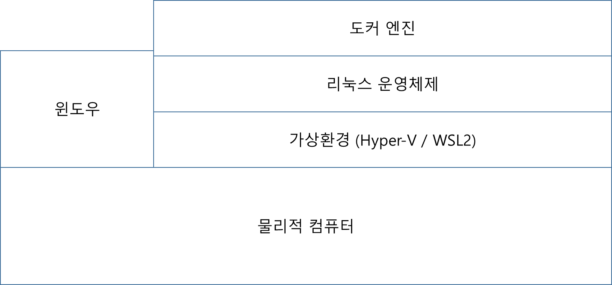
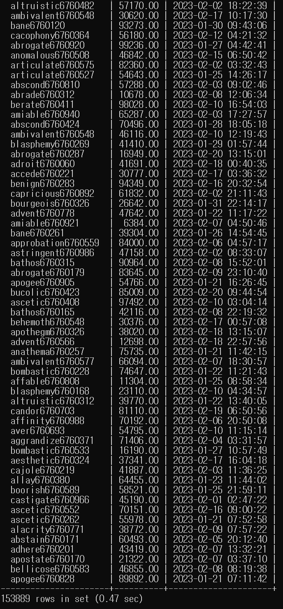

## 사전 학습

## 기본 용어 정리

### 클래스란?
- 객체를 만들기 위한 **설계도, 틀**로 비유한다.
- 연관된 변수와 메서드의 집합이다.

### 객체란?
- 소프트웨어 세계에서 **구현할 대상**으로 비유한다.
- 물리적으로 존재하거나 추상적으로 생각할 수 있는 것, 자신의 속성을 가지며 식별가능한 모든 것은 객체가 될 수 있다.
- 클래스로 인해 생성된 실체를 의미하며, 객체는 인스턴스를 대표하는 포괄적인 의미를 지닌다.

### 인스턴스란?
- 클래스를 기반으로 구현된 **구체적인 실체**를 의미한다.
- 즉, 객체를 실체화한 것이 인스턴스다.
- 추상적 개념과 구체적 개념 사이의 관계에 초점을 맞출 때 사용되기도 한다.
  - myCoffee는 커피 클래스의 인스턴스이다.
- 인스턴스는 어떤 원본(추상 개념)으로부터 생성된 복제본을 의미한다.

객체와 인스턴스는 엄격하게 구분하기 힘든 추상적인 개념이며, 주로 인스턴스는 원본으로부터 생성되었다는 것을 강조하는 의미로 많이 쓰인다.

## 프로그래밍 구조

### 프로퍼티
Key=Value 형식으로 파라미터 정보를 저장하기 위한 파일 확장자. Key Value를 (String, String)형태로 저장하는 단순화된 컬렉션이라고 보면 된다.
주로 응용프로그램에 대한 환경 설정 정보, DB환경설정정보를 저장할 때 properties 파일을 만들어 저장한다.
Java에서는 java.util의 ResourceBundle 라이브러리를 이용해서 properties를 호출할 수 있다.

### 메소드
객체지향 프로그래밍에서 객체와 관련된 서브 루틴(함수)를 의미한다. 객체의 데이터, 멤버 변수에 대한 접근 권한을 가진다. 클래스 기반 언어(Java 등)에서는 내부에 정의된다. 

### 캡슐화
클래스 내부 변수와 메소드를 하나로 패키징하는 특징. 내부 변수와 메소드를 패키징하여 내부 상태의 조작을 외부에 개방된 메소드를 통해서만 가능하도록 만든다.
이는 접근 제어자의 사용을 통해 내부 변수나 메소드를 은닉함으로써 가능해지는데, 은닉과 캡슐화를 통해 객체의 응집도와 독립성을 높일 수 있다.

### 상속
객체들 간의 관계를 구축하는 방법. 상속을 통해 기존 클래스로부터 속성, 동작을 물려받거나, 추상 메서드, 추상 클래스를 구현할 수 있다.
상속의 가장 큰 특징은 계층관계를 구축한다는 것이다. 상속관계는 리스코프 치환 원칙에 의해서 확인할 수 있다.

### 다형성
하나의 객체가 여러 가지 타입을 가질 수 있는 것을 의미. 자바에서는 부모 클래스 타입의 참조 변수로 자식 클래스의 인스턴스를 참조할 수 있도록 함으로써 구현한다. 이러한 경우 자식 클래스 만의 멤버를 호출할 수 없으므로 사용할 수 있는 멤버의 개수가 같거나 적어지게 된다.

### 업캐스팅, 다운캐스팅
- 업캐스팅 : 하위 클래스를 상위 클래스로 타입 변환하는 것을 의미한다.
  - CaffeineBeverage beverage = new Coffee(); (O)
- 다운캐스팅 : 상위 클래스를 하위 클래스로 타입 변환하는 것을 의미한다.
  - Coffee coffee = (Coffee)beverage;

## 객체지향 개발 5대 원리

[객체지향 5가지 원리 참고자료](https://www.nextree.co.kr/p6960/)
### 단일 책임의 원칙(Single Responsibility Principle)

#### 정의
- 클래스는 하나의 기능만 가지며, 모든 서비스는 하나의 책임을 수행하는데 집중해야한다는 원칙.
- 책임 영역이 확실해지므로 하나의 변경사항으로 인해 다른 책임을 변경해야하는 연쇄작용의 발생을 막을 수 있다.
- 가독성, 유지보수성 향상
#### 적용방법
- 분리된 클래스의 책임이 유사하면 SuperClass를 추출한다.
- 책임을 모으거나, 새로운 클래스를 생성한다.

### 개방 폐쇄의 원칙(Open Close Principle)

#### 정의
- 소프트웨어 구성요소는 확장에는 열려있고, 변경에는 닫혀있어야 한다는 원리. 
- 요구사항의 변경이나 추가사항이 발생하더라도, 기존 요소의 변경은 일어나지 않고, 기존 요소를 확장해서 재사용할 수 있도록 설계되어야한다.
- 추상화와 다형성을 통해서 가능하다.

#### 적용방법
- 인터페이스를 정의할 때, 가능하면 변경되지 않도록 다양한 경우의 수를 고려해야한다.
- 적절한 수준의 예측능력으로 적당한 추상화 레벨을 선택해야 한다.

### 리스코브 치환의 원칙(The Liskov Substitution Principle)

#### 정의
- 서브 타입은 항상 기반 타입으로 교체할 수 있어야 한다.
- 아래 두 문장대로 구현된 프로그램은 리스코프 치환 원칙을 지키고 있는 프로그램이다.
  - 하위 클래스 is a kind of 상위 클래스
  - 구현 클래스 is able to 인터페이스
- 하위 클래스의 인스턴스는 상위형 객체 참조 변수에 대입해 상위 클래스의 인스턴스 역할을 하는데 문제가 없어야 한다.
- 즉, 올바른 상속 관계에 대한 규약을 정의하는 원칙이다.

#### 적용방법
- 두 개체가 같은 일을 한다면, 하나의 클래스로 표현하고 구분하는 필드를 둔다.
- 똑같은 연산을 제공하지만 약간 다르게 하면 공통의 인터페이스를 만들고 각자 구현한다.
- 두 개체가 하는 일에 추가로 무언가를 한다면 구현 상속을 사용한다.
- 공통된 연산이 없다면 별개인 2개의 클래스를 만든다.

### 인터페이스 분리의 원칙(Interface Segregation Principle)

#### 정의
- 자신이 사용하지 않는 인터페이스는 구현하지 말아야 한다는 원리
- SRP는 클래스 분리를 통해 변화의 적응성, ISP는 인터페이스 분리를 통해 같은 목표에 도달.
- SRP가 클래스의 단일 책임을 강조한다면, ISP는 인터페이스의 단일 책임을 강조
- 그 인터페이스를 사용하는 클라이언트를 기준으로 분리하여, 클라이언트 입장에서 사용하는 기능만 제공하도록 해야한다.

#### 적용방법
- 클래스 인터페이스를 통한 분리 - Inheritance
  - 상속받는 순간 Hard coupling이 발생
- 객체 인터페이스를 통한 분리 - Delegation
  - 다른 클래스의 기능을 사용해야하지만 변경하고 싶지 않은 경우

### 의존성 역전의 원칙(Dependency Inversion Principle)

#### 정의
- 추상화된 것은 구체적인 것에 의존하면 안된다.
- 그러한 경우, 구체적인 것을 추상화하여 추상에 의존하도록 변경해야한다.

#### 적용방법
- 구체적인 것에 의존하는 경우, 인터페이스에 의존하도록 변경하여 의존관계를 역전시킨다.

## GRASP 패턴

### 정의
General Responsibility Assignment Software Patterns의 축약어로, 객체 지향 디자인 시 각 객체에 책임을 할당하는 것에 대한 원칙들이다. 일반적으로 디자인 패턴으로 불리는 것과 같은 구체적인 구조가 아니고, 디자인 패턴이 GRASP 패턴을 각각 구체적으로 구현한 것이라 볼 수 있다.

### Information Expert
- 역할을 수행할 수 있는 정보를 가지고 있는 객체에 역할을 부여
- 데이터와 처리로직을 함께 Binding하고, 자신의 처리 로직에서 처리한 후 외부에 그 기능을 제공한다.

### Creator
- 객체의 생성은 생성되는 객체의 컨텍스트를 알고 있는 다른 객체에 부여한다.(있다면)
  - B 객체가 A 객체를 포함
  - B 객체가 A 객체의 정보를 기록
  - A 객체가 B 객체의 일부
  - B 객체가 A 객체를 긴밀하게 사용
  - B 객체가 A 객체의 생성에 필요한 정보를 가지고 있다.

### Controller
- 시스템 이벤트(사용자 요청)을 처리할 객체를 만든다.
- 외부와 시스템 간에 요청을 처리해주는 중간 객체로 시스템 객체의 수정이 발생할 때, 외부에 주는 충격을 완화.

### Low Coupling
- 객체들간 상호의존도가 낮게 역할을 부여한다.

### High Cohesion
- 각 객체가 밀접하게 연관된 역할만 가지도록 부여한다.
- 한 객체가 자신의 역할을 잘 수행하도록 구성된다면, 다른 객체를 참조할 일이 적어진다.

### Polymorphism
- 종류에 따라 행동양식이 바뀐다면, 다형성 기능을 이용한다.
- 조건문 대신 다형성으로 바꿔보자.(상속, 인터페이스 구현)

### Pure Fabrication
- 기능적인 역할을 한 곳으로 모은다. 
- 예로, 데이터베이스 정보, 로그 정보를 기록하는 역할의 경우 각 객체가 기록하는 역할을 DB 객체로 모아 종속성을 제거한다.
- 공통적인 기능을 제공하는 역할을 모아 가상의 객체를 만들어라.

### Indirection
- 두 객체 사이 직접적 Coupling을 가상의 다른 객체로 제거하라.
- 주로 인터페이스를 이용한다.

### Protected Variations
- 변경 여지가 있는 곳에 안정된 인터페이스를 정의해서 사용한다.

## 직선 길이

### 기능요구사항
- 사용자가 점에 대한 좌표 정보를 입력하는 메뉴를 구성한다.
- 좌표 정보는 괄호 (, )로 둘러쌓여 있으며 쉼표(,)로 x값과 y값을 구분한다.
- 좌표값을 두 개 입력한 경우, 두 점을 있는 직선으로 가정한다. 좌표값과 좌표값 사이는 - 문자로 구분한다.

### 프로그래밍 요구사항
- X, Y좌표 모두 최대 24까지만 입력할 수 있다.
- 입력 범위를 초과할 경우 에러 문구를 출력하고 다시 입력을 받는다.
- 입력을 담당하는 별도 모듈 또는 객체를 꼭 선언한다.
- 정상적인 좌표값을 입력한 경우, 해당 좌표에 특수문자를 표시한다.
- 직선인 경우는 두 점 사이 거리를 계산해서 출력한다.

### 기능 구조
- Graphics Interface
- Dot 클래스
- InputView 클래스
- OutputView 클래스
- Controller 클래스
- Calculator 클래스

### 구현 결과

## 삼각형 넓이

### 기능요구사항
- 좌표값을 세 개 입력한 경우, 세 점을 연결하는 삼각형으로 가정한다.
- 삼각형인 경우 삼각형의 넓이를 계산해서 출력한다.
- 세 변의 길이를 알 때 삼각형의 넓이를 구하는 공식은 헤론의 공식을 이용해 구할 수 있다.

### 구현 과정
- Line을 상속받은 Triangle 객체를 구현하였다.
- Line과 공유하는 Drawable 인터페이스를 통해 구현되도록 하였다.
- 헤론의 공식을 적용해서 삼각형의 인스턴스인 경우 삼각형의 넓이를 계산한다.

### 구현 결과

## 사각형 넓이

### 기능요구사항
- 좌표값을 네 개 입력한 경우, 네 점을 연결하는 사각형으로 가정한다.
- 네 점이 뒤틀어진 사다리꼴이나 마름모는 제외하고 직사각형만 허용하도록 검사한다.
- 사각형인 경우 사각형의 넓이를 계산해서 출력한다.
- 사각형 면적은 width * height 방식으로 계산할 수 있다.
- 모든 객체가 같은 인터페이스를 갖도록 계산과 관련된 메시지를 추상화한다.
- 타입별로 출력을 구분하기 위해서 타입을 비교하지말고 상속과 다형성을 활용해서 구현한다.

### 구현 과정
- 사각형임을 판별하기 위해 사각형을 구성하는 임의의 세 점에 대해 모두 직각삼각형인지를 판별한다.
  - 직각삼각형은 세 변에 대해 만족하는 피타고라스 정리가 존재해야한다.
- Line, Triangle 객체를 상속받으며 Drawable 인터페이스를 구현한다.

### 구현 결과

## 다각형 넓이

### 기능요구사항
- 좌표값을 5개 이상 입력한 경우, 다각형으로 가정한다.
- 다각형인 경우 기준점을 정해서 삼각형으로 나눠서 처리하고, 삼각형 타입을 활용해서 다각형 넓이를 계산한다.

### 구현 과정
- Line, Triangle 객체를 상속받는다. (사각형은 아닐 수도 있다.)
- 점의 순서를 반시계 방향으로 정렬한다.
- 정렬된 점에 대해서 순회하며 삼각형들의 합으로 넓이를 계산할 수 있다.
- 그러나, 볼록한 다각형(볼록한 다각형의 정의를 참고)이 아닌 경우 다른 방법으로 계산해야한다.

### 구현 결과

