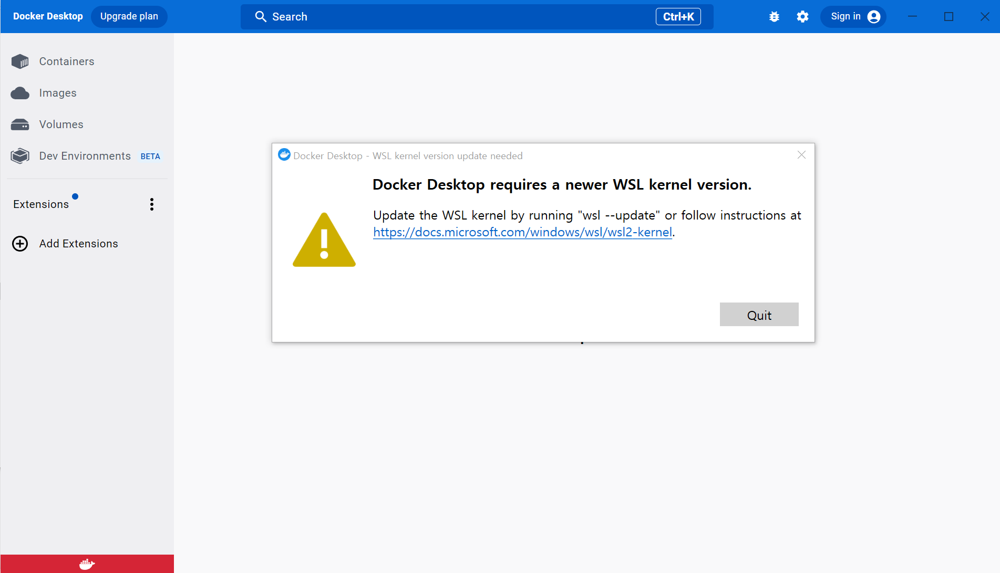

# 학습 계획

## 미션 1 - 영상 데이터 구조

### 학습 목표
- 영상 정보를 보관하는 데이터 구조를 선언하고, 연속 배열에 데이터 인스턴스를 생성한다

- 링크드 리스트 구조(Linked List)를 구현하기 위해서 데이터 구조에는 다음 영상 정보를 참조할 수 있어야 한다.

### 학습 내용
<details>
<summary>Data Structure(List)</summary>

- 데이터 스트럭쳐를 배우는 이유 : 자료 구조를 통한 메모리의 효율적 사용
- RAM(Random Access Memory) : 데이터 주소를 통해 데이터에 접근하는 시간이 동일하다.
- 배열 리스트와 연결 리스트의 특징 비교
  - Array List : 메모리 주소 상에 연속으로 붙어있다.
    - 한 번 할당을 하면 배열의 크기를 변경하기 어렵다. 더 많은 배열의 할당이 필요하면 메모리 상의 다른 주소를 확보한 후 전체가 옮겨가야한다.(재할당)
    - 위치를 알고있다면 데이터의 접근은 매우 빠르다.
  - Linked List : 각 데이터들이 메모리 상에 흩어져 있지만 연결되어 있다.
    - 서로 떨어져있기 떄문에 가변적으로 데이터를 관리하기 용이하다.
    - 엘리먼트의 index에 따라서 데이터를 탐색하는데 걸리는 시간이 상이하다.(비효율적)

</details>
<details>
<summary>Linked List의 구현</summary>

- 연결 리스트의 구조
  
  - Node, Vertex(정점) : 연결 리스트의 요소를 나타내는 표현, 연결성을 강조한 표현임
  - 객체 지향 언어에서는 객체를 사용해서 연결 리스트를 구현한다.
  - 헤드 필드 : 첫번째 노드의 위치를 가지고 있는 필드
  - 데이터 필드 : 데이터가 저장되는 필드
  - 링크 필드 : 다음 노드를 가리키는 필드
- 연결 리스트의 상세 구현
  - 연결 리스트 객체
    - node 참조 객체
      - next 필드() : 다음 노드의 주소를 저장
      - value 필드 : 현재 노드의 값을 저장
    - head 필드 : node 참조 변수를 저장한다.
</details>
<details>
<summary>연속 메모리를 차지하게 생성하기</summary>

처음에는 정보를 가지는 각 인스턴스들의 배열로 선언하려고 했는데, 문제의 제약 조건 중 배열에 저장하지 말라는 조건이 있어, 저장하지 않고 반복문으로 인스턴스 생성 후 바로 출력하도록 처리하였다. 반복적으로 생성했을 때 메모리 상에서 연속적으로 존재할 것이며, 배열을 저장하지 않는다는 조건도 만족할 수 있었다.  

```
public VideoArrayList(int number) {
        for (int i=0;i<number;i++) {
            View.printResult(new VideoNode());
        }
    }
```

그리고, 아래 메모리 주소 확인하는 라이브러리로 객체의 메모리가 과연 연속으로 존재하는지 조회하였는데 일단 불연속적으로 존재한다는 결론을 내렸다. 메모리를 연속으로 배치할 수 있는 방법이 따로 있는건지 확인이 필요하다.
```
// 객체의 주소 확인 명령어 : System.identityHashCode();
// 결과 값이 10진법으로 출력되어 long.toHexString으로 16진법 변환

7291c18f
34a245ab
7cc355be
6e8cf4c6
12edcd21
34c45dca
52cc8049
5b6f7412
27973e9b
312b1dae
7530d0a
27bc2616
3941a79c
```

</details>
<details>
<summary>연속 메모리 상에 있는지 조회하기</summary>
</details>
<details>
<summary>정해진 크기 단위로 접근해서 탐색하기</summary>
</details>

### 프로그래밍 요구사항
- [O] 영상 데이터 구조를 13개 생성한다
- [O] 각 영상 데이터에는 고유한 id가 할당된다
- [O] 데이터 구조를 생성하고 저장하지 않고 출력만 한다
- [O] 제목은 "제목01" 부터 시작해서 "제목13" 까지로 할당한다
- [O] 재생 시간은 랜덤하게 1초에서 15초 내로 지정한다
- [O] 다음 영상 정보는 우선 지정하지 않는다
- [O] 생성한 데이터는 연속된 메모리 공간을 차지하도록 한꺼번에 생성한다
- [O] 이 단계에서는 연속 메모리를 관리해야 하며, 연결리스트를 구현해야 하는 건 아니다
- [O] 13개 모두 생성하고 나면 정해진 크기단위로 접근해서 탐색할 수 있어야 한다
- [O] 생성한 영상 순서대로 제목(id):재생시간 형식으로 출력한다.

## 미션 2 - 영상 목록 편집하기

### 학습 목표
- [ ] 영상 데이터 구조를 연결하는 연결리스트LinkedList를 구현한다.
- [ ] 링크드 리스트에 영상 데이터를 원하는 위치에 넣거나 삭제하는 동작을 구현한다.
- [ ] 전체 링크드 리스트를 탐색해서 최종 영상 정보를 표시한다.
- [ ] Array 나 List 를 사용하지 않고 직접 데이터 구조만 사용해서 구현해야 한다.

### 학습 내용
<details>
<summary>자료 구조에서 지원하는 연산들</summary>

- 선회 : 
- 찾기 :
- 삽입 :
- 삭제 :
- 정렬 :
- 병합 :
- 기타 :
</details>
<details>
<summary>List Operation 구현하기</summary>

- 연결 리스트의 삽입
  - array list는 삽입 시 뒤의 모든 엘리먼트의 자리 이동이 필요해 느린 반면, linked list는 참조값 2개만 변경시키면 되어서 빠르다.
  - temp1는 삽입하려는 전 인덱스의 node를 참조
  - temp2는 삽입하려는 후 인덱스의 node를 참조
  - temp1.next는 새로운 노드를 참조
  - 새로운 노드의 next는 temp2를 참조
- 연결 리스트의 삭제
  - 삭제할 노드의 이전 노드를 cur 참조변수가 참조하도록 한다.
  - 삭제할 노드를 temp 참조 변수를 생성해서 참조하도록 한다.
  - 삭제할 노드의 뒷 노드를 cur.next가 참조하도록 한다.
- 연결 리스트의 조회
  - 참조변수를 counter만큼 next로 넘긴다.
</details>
<details>
<summary>Big O란?</summary>

</details>
<details>
<summary>Big O 확인하기</summary>

</details>

### 기능요구사항
- [ ] 이전 단계에서 만든 영상 데이터가 메모리 공간에 저장되어 있고 이번 단계에서는 영상 데이터들을 참조해서 가상으로 목록으로 연결하는 구조를 만들어야 한다
```
* 여러 영상 데이터를 보관하는 곳이 있다.
* 보관중인 영상 데이터 중에서 원하는 데이터를 선택해서 타임라인을 채우는 구조를 구현해야 한다.
  ```
- [ ] 영상 데이터를 재생하려는 순서에 맞춰서 연결 리스트를 관리한다.
  - 노드 추가하기
  - 노드 삭제하기
  - 노드 탐색하기

- [ ] 영상편집 데이터를 보관하는 구조를 Array 나 List (또는 Vector 등)를 사용하지 않고 직접 구현한 데이터 구조만 사용해서 구현해야 한다.
- [ ] 이전 단계에서 구현한 영상데이터를 보관하는 연결 배열과 구분해서 직접 구현해야 한다

### 프로그래밍 요구사항
- [ ] 앞 단계에서 생성한 데이터를 선택해서 편집하려는 순서대로 링크드 리스트로 연결하는 방식이다.
- [ ] 메뉴는 명령어 + 공백 + 영상id 또는 명령어 + 공백 + 영상id + 공백 + 위치형식을 갖는다.
- [ ] add abab를 입력하면 맨 뒤에 abab 영상을 추가한다.
- [ ] insert cafe 0를 입력하면 맨 앞에 0번째에 cafe 영상을 추가한다.
  - [ ] 만약 맨 뒤에 순서값이 현재 링크드 리스트에 개수보다 같거나 크면 맨 뒤에 입력한다.
  - [ ] add 나 insert 시에 이미 만들어진 영상id가 없으면 추가하지 않고 node not exist를 출력한다
  - [ ] add나 insert로 영상 노드를 중복해서 추가할 수도 있다
- [ ] delete abcd를 입력하면 링크드 리스트 시작 위치부터 abcd를 찾아서 삭제한다.
  - [ ] 만약 뒤에 다른 영상 데이터 정보가 있으면 이전 정보를 연결한다.
  [cafe]---[abcd]---[bdfa] 에서 [abcd]를 삭제하면 [cafe]---[bdfa] 상태가 되어야 한다
- [ ] 해당 node가 없을 경우 node not found를 출력한다
- [ ] 매칭되는 노드를 삭제하고 나면 탐색을 중지하고 뒤에 있는 노드를 삭제하지 않는다
- [ ] render를 입력하면 링크드 리스트를 전체를 탐색하면서 재생 시간을 더한다.

