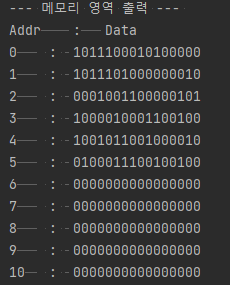
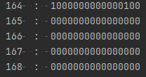
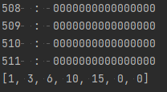

## 학습 계획서

### 학습 목표
- 컴퓨터를 구성하는 3가지 요소 중에서 CpuSimulator 부분에 대해 이해하고, 구현하는 것이 목표다.
- CpuSimulator 구성 요소에 대해 이해하고, CpuSimulator 명령어를 처리하도록 구현한다

### 학습 내용
#### CPU의 기능
- CPU는 명령어 인출과 해독을 모든 명령어에 대해 공통 수행
- 데이터 인출, 데이터 처리, 데이터 저장을 명령어에 따라 필요한 경우 수행
- 명령어 인출 : 기억장치로부터 저장된 명령어를 읽어오는 과정
- 명령어 해독 : 수행해야할 동작을 결정하기 위해 명령어를 해독하는 과정
- 데이터 인출 : 데이터가 필요한 경우, 기억/입출력 장치로부터 데이터를 read
- 데이터 처리 : 데이터에 대한 산술,논리적 연산 수행
- 데이터 저장 : 처리 과정을 거쳐 얻어진 결과를 저장하는 과정

#### CPU의 내부 구성 요소
- ALU 
  - 연산을 하는 장치
    - 산술 : 사칙 연산
    - 논리 : AND OR NOT XOR
- 레지스터
  - 액세스 속도가 가장 빠른 기억 장치
  - CPU 내부의 레지스터 수는 제한
- 제어 유닛
  - 명령어를 해석하고 실행하기 위한 제어 신호를 발생시키는 하드웨어 모듈
- CPU 내부 버스
  - 제어 유닛으로부터 발생되는 제어 신호 선들
  - ALU와 레지스터 간에 데이터 이동을 위한 데이터 선
  - 외부 시스템과 직접 연결 X, 버퍼 레지스터 or 시스템 버스 인터페이스 회로를 통해 접속

### 명령어 사이클
- 정의 : 명령어 사이클은 CPU가 1개의 명령어를 실행하는 전체 처리 과정을 의미, 프로그램 실행 시작부터 전원 종료나 회복 불가한 오류가 발생해서 중단될 때까지 반복
- 2개의 Subcycle로 나눈다.
  - 인출 : CPU가 기억장치에서 명령어를 읽어오는 단계
  - 실행 : 명령어를 실행하는 단계
- fetch cycle
  - to(Memory Address Register ← PC) 
    - PC에 존재하는 주소 값을 MAR에 전송
  - t1(Memory Buffer Register ← Memory Address Register 주소 Memory 데이터)
  - t1(PC ← PC + 명령어의 크기 단위)
  - t2 : IR ← Memory Buffer Register
    - MBR에 일시 저장한 명령어를 실행하기 위해 IR로 전송 
  - (t는 CPU 클록 주기를 의미한다.)
- execution Cycle
  - ex) LOAD
  - t0 : Memory Address Register ← IR
  - t1 : Memory Buffer Register ← Memory(Memory Address Register)
  - t2 : Accumulator(여기에서는 destination Register) ← Memory Buffer Register
  - Memory Address Register를 여기서에서는 Base Register와 Offset Register로 나누어서 배열에 접근함.
- 산술, 논리 연산 cycle
  - t0 : Memory Address Register ← IR
  - t1 : Memory Buffer Register ← M(Memory Address Register)
  - t2 : AC ← AC Operand MBR 
  - Basic 컴퓨터는 CPU에서 계산이 이루어지는 원리는 누산기 레지스터 저장 되어있는 값과 메모리 버퍼 레지스터의 값을 로드하여 ALU에서 연산한다.
  - 이 문제에서 누산기를 Register 중 하나로 묶어놓았음

- 명령어 실행에 필요한 레지스터
  - Program Counter(PC)
    - 다음 인출에 필요한 명령어 주소를 가지고 있는 레지스터
    - 인출 직후 명령어의 크기만큼 증가됨.
    - 분기(Branch) 명령어가 실행되는 경우에는 목적지 주소를 갱신
  - 누산기 (Accumulator)
    - 데이터를 일시적으로 저장하는 레지스터로 연산 결과 저장
    - 레지스터 크기는 CPU가 한번에 처리 가능
  - MAR(Memory Address Register) : CPU가 읽거나 쓰려는 메모리 주소를 일시적으로 저장, 일부 데이터 저장하거나 데이터를 읽을 때 필요한 메모리 위치 주소를 저장한다.
  - MBR(Memory Buffer Register) : 메모리에 읽거나 쓰려는 데이터 또는 명령을 일시 저장한다. 명령은 IR로 전송되며, 데이터는 AC 또는 I/O 레지스터로 전송된다. 즉, 이 레지스터는 메모리를 읽거나 메모리에 쓰려는 데이터 또는 명령을 임시 저장하는데 사용된다.
  - IR(Instruction Register) : 메모리에서 명령을 가져오면 명령어 레지스터에 저장된다. 제어장치는 이 레지스터의 지시를 받아 컴퓨터 요소로 신호를 전송, 명령을 해석하며 실행한다.


### Instruction Code

- CPU를 제어하기 위한 코드
- Memory Reference Instruction
  - Operation Code(Opcode) + address part
  - 연산 방법을 선택하는 코드와 피연산자의 주소 부분으로 나뉜다.
  - Address part의 들어오는 값은 addressing mode에 따라 나뉜다.
    - Address part에 들어있는 비트를 어떻게 해석할지에 대한 모드, 16비트는 2가지만 가진다.
    - 0 : direct addressing : operand = M[address]
      - 즉, 피연산자가 들어있는 메모리 주소를 나타낸다.
    - 1 : indirect addressing : operand = M[M[addresss]]
      - 피연산자가 들어있는 주소를 가리키는 메모리 주소
  - OpCode는 연산 방법을 지정한다.
  - Address part 자리에는 피연산자가 존재하는 주소 정보

- register-reference instruction
  - operand를 필요로 하지 않는 instruction
  - 하위 비트로는 연산의 종류를 결정한다.
  - clear accumulator 등
- input-output instruction
  - operand를 필요로 하지 않는 instruction
  - 하위 비트로는 연산의 종류를 결정한다.
  - interrupt on, input char to AC 등

### 좋은 instruction set이란?
다음 조건을 만족하면 complete한 명령어집합이라고 한다.
- 산술, 논리, 쉬프트 명령 정의
- 메모리, 프로세스 레지스터로 정보를 load, store 명령이 정의
- 컨트롤 명령의 정의(조건에 따른 분기 - branch, increment and skip if zero 등)
- input, output 등 I/O 명령 정의

### dump
- 어떤 장애가 발생했을 때, 디버그를 위해 기억장치에 기억시킨 내용을 보조기억 장치 등 매체에 복사, 전이
- 혹은 주기억장치, 레지스터에 존재하는 내용 자체

### 기능 요구사항
객체 구현
- CpuSimulator Class : 기본 처리단위는 16비트(2Byte)
  - 레지스터 Class
    - 범용 사용 레지스터 (R1 ~ R7)
    - 프로그램 카운터 레지스터 (R0)
    - Operation Register는 문제에서 별도의 구분이 없음
  - Alu Class : 기초 연산만 존재
    - ADD
    - SUB
    - AND
    - OR
- Memory Class : 자료구조를 포함한 저장 클래스, Key(address)와 Value로 대응되는 자료구조

### 기능 구현
- [O] LOAD : (base + offset) 주소 메모리 값을 읽어서 dst.Reg에 저장한다.
- [O] STORE : src.Reg 값을 (base + offset) 주소 메모리에 저장한다. 
- [O] AND : 논리 AND 연산해서 dst.Reg에 저장한다.
- [O] OR : 논리 OR 연산해서 dst.Reg에 저장한다.
- [O] ADD : 덧셈 (+) 연산해서 dst.Reg에 저장한다. (AND와 OR을 이용해 구현)
- [O] SUB : 뺄셈 (-) 연산해서 dst.Reg에 저장한다.
- [O] MOV : op.Value 값을 dst.Reg에 저장한다.

### Cpu Class 메서드 구현
- [O] reset() : 레지스터 값을 모두 지우고 PC 값도 0으로 초기화한다.
- [O] fetch() : 현재 PC 값에 해당하는 메모리에서 프로그램 명령어를 가져와서 리턴한다. PC 카운트를 +1 증가시킨다.
  - fetch에서 리턴한 명령을 execute로 넘겨준다.
- [O] execute(Int16 IR) : 전달한 명령어를 어떤 명령인지 분석해서 계산하거나 처리
- [O] dump() : REGISTER들 값을 배열에 넣어서 리턴한다.

### 구현 결과

메인 함수의 insertProgram 메서드로 실행할 Instruction을 메모리 상에 로딩할 수 있다.
Instruction 정의는 주석을 참고.

```
 public static void insertProgram(Memory memory) {
        memory.set((short)0, memory.bin2Short("1011 100 010100000")); //0x0000b MOV R4, 0x00A0 - R4에 160을 담는다.
        memory.set((short)1, memory.bin2Short("1011 101 000000010")); //0x0010b MOV R5, 0x0002 - R5에 2를 담는다.
        memory.set((short)2, memory.bin2Short("0001 001 100 000 101")); //0x0020b LOAD R1, R4, R5 - 162번째에서 데이터를 가져와서 R1
        memory.set((short)3, memory.bin2Short("1000 010 001 1 00100")); //0x0030b ADD R2, R1, #4 - R2에 (0+4)
        memory.set((short)4, memory.bin2Short("1001 011 001 000 010")); //0x0040b SUB R3, R1, R2 - R3에 (0 - 4) = -4 저장
        memory.set((short)5, memory.bin2Short("0100 011 100 1 00100")); //0x0050b STORE R3, R4, #4 (-4)를 164에 저장.
    }
```

### 메모리 Instruction 영역(Code)


아래처럼 메모리 상에 값이 임시로 저장된다. 일반적으로 Heap영역의 동작을 모사한다고 볼 수 있다.



### 레지스터 Dump
1~5까지 더하는 계산기 Instruction을 넣었을 때 레지스터 덤프 값이다.
15의 값을 메모리 주소에 저장하기 전에 레지스터 R5에 임시 저장된다.


