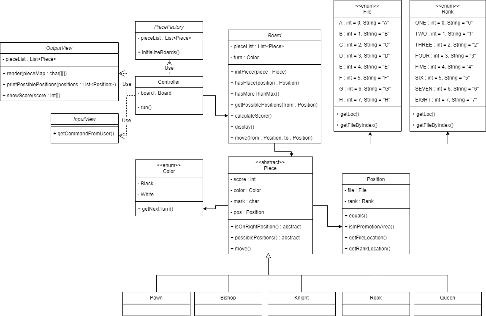
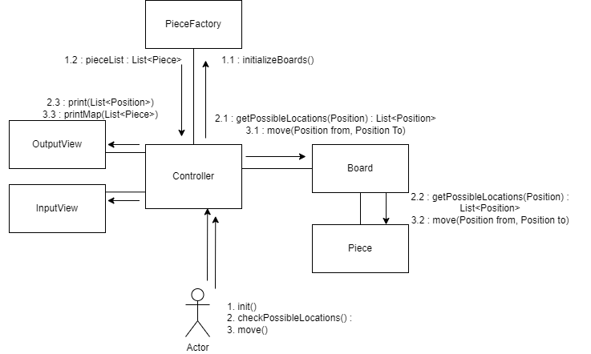

## 체스 게임

### 학습 내용 정리

### 객체 개별성(Identity)와 동등성(Equality)

- 인스턴스가 다르면 개별성 Identity가 다르다.
- 속성이 모두 같으면 동등한 값을 가지므로 동등성(Equality)은 같다.
- 개별성, 동질성을 통해 인스턴스를 비교한다.
- 언어마다 개별성, 동질성을 구분하며 다르게 비교하는 비교연산자를 제공하기도 한다.

### Java equals와 hashCode

- 모든 객체는 Object 클래스의 equals와 hashCode를 상속받는다.
- equals : 2개의 객체의 동일성(Identity)를 비교한다.
  - 동일한 메모리 주소일 경우에만 동일한 객체가 된다.
- 동등성을 비교해주기 위해 equals를 오버라이딩 할 수 있다.
- String의 equals는 동등성을 비교하도록 Overriding된 메소드이다.
- HashCode 메소드는 런타임 객체의 유일한 integer 값을 반환한다.
- hashCode는 hashTable과 같은 자료 구조를 사용할 때 데이터가 저장되는 위치를 결정하기 위해 사용된다.
- 동일한 객체는 동일한 해시코드를 가져야한다. 따라서 equals 메소드를 오버라이드할 때, hashCode 메소드도 함께 오버라이드되어야한다.

### equals와 hashCode
- equals한 두 객체는 hashCode값도 일치해야한다.
- Java 프로그램 실행 중에 equals에 사용된 정보가 수정되지 않으면 hashCode는 항상 동일한 값을 반환해야한다.

### UML 통합 모델링 언어
UML(Unified Modeling Language)?
산출물의 명세화, 시각화, 문서화할 때 사용하는 모델링 언어로 시스템을 표현하기 위한 표준적인 방법을 제공

- 구조 다이어그램
- Class diagram : 클래스 속성, 함수, 변수 타입들로 구성된 다이어그램
- Object diagram : 클래스 인스턴스, 값이 매겨진 행동을 가지고 있는 독립된 객체정보를 표현
- Package Diagram : 모델 요소들을 그룹화한 다이어그램
- Component Diagram
- Deployment diagram
- 행위 다이어그램
- Use Case Diagram : 사용자 관점에서 바라본 시스템을 표현한 다이어그램
- Activity Diagram : 여러 활동들이 순차, 병행 방식 등을 수행하는 상황을 표현하는 다이어그램, 시스템 전체의 흐름을 표현
- State Diagram : 하나의 객체가 다른 객체와 상호작용에 따라 어떻게 변화하는지 표현, 하나의 객체의 활동변화를 묘사
- Sequence Diagram : 여러 대상 간의 상호작용을 시간 순서에 따라 표현
- Communication Diagram : 동작에 참여하는 객체들 간 메시지를 표현, 관계까지 표현

### 타입 시스템

1. Static Type System
컴파일 시점에 타입이 정해지고, 타입에 적합한 값만 지정 가능
2. Dynamic Type System
런타임에 타입이 (변경 가능) 정해진다.
3. Strong Type System
컴파일러가 타입 검사를 강하게 하는 경우, 컴파일 과정마다 타입이 결정된다.
4. Weak Type System
컴파일러가 타입 검사를 약하게 하고, 런타임에서 에러가 발생한다.
5. Duck Type System
동적 타입 시스템의 일종으로 타입 고유의 행위를 구현하면 그 타입으로 간주하는 시스템
6. Untype System
타입 구분 없이 모든 데이터 구조가 하나의 타입으로 인지되는 시스템.

### 메타 타입
타입에 대한 타입, 타입 자체를 값으로 다룰 수 있는 타입
java - getClass 등으로 타입 비교


### 구현
- [O] Board 클래스부터 구현하고 Pawn, Bishop, Rook, Queen, Knight 클래스를 각각 다른 파일로 저장한다.
- [O] 프로그램을 시작하면 King을 제외한 흑/백 체스말을 초기화한다.
- [O] 프로그램을 동작하는 동안, 반복해서 입력을 받는다.
- [O] 움직이려는 말이 있는 위치와 이동하려는 위치를 차례 입력받아서 말을 이동한다.
- [O] 입력값은 말이 있는 위치 2자리 문자와 -> 화살표와 이동하려는 위치 2자리 문자를 입력받는다. 형식에 맞지 않으면 다시 입력받는다.
- [O] 만약 흑 또는 백 체스말이 상대편 말이 있던 곳으로 이동해서 잡는 경우는 현재 체스판 점수를 출력한다.
- [O] 입력값이 ?물음표로 시작하면 해당 위치에 있는 말이 움직일 수 있는 경우를 모두 출력한다.
- [O] 만약 같은 색의 말이 진행 방향에서 가로막고 있는 경우는 그 직전까지만 표시한다.
- [O] 체스말을 이동하는 명령은 백색부터 시작해서, 흑과 백이 번갈아서 입력해야 한다. 입력할 때마다 체스판 체스말 현황을 출력한다.
- [O] 기능 요구사항과 프로그래밍 요구사항을 분석하고, 각자 나름의 기준으로 설계를 하고 그림이나 문장으로 표현해서 readme 문서에 기록한다.

### 보드판

- [O] Board는 현재 있는 말을 확인해서 흑과 백 점수를 출력한다. 
- [O] 색상별로 Pawn 1점, Bishop와 Knight 3점, Rook 5점, Queen은 9점으로 계산한다.
- [O] Board는 모든 말의 위치를 간접적으로 알 수 있다. display() 함수는 적절한 데이터 구조로 1-rank부터 8-rank까지 rank 전체를 리턴한다.
Board에서 return한 데이터 구조를 바탕으로 출력 형식을 담당하는 객체(혹은 모듈)에서 문자열 배열 바꾸고 체스판을 출력하도록 전달한다.
- [O] 특정 위치에 특정 말을 생성하는 initPiece(type, position) 함수를 구현한다.
- [O] 특정 위치에 특정 말을 생성하는 setPiece(type, position) 함수를 구현한다.
- [O] 특정 말을 옮길 때는 Board에서 제공하는 move(from, to) 함수를 사용한다.

### 체스말

- [O] 체스말은 위치값을 Position 타입으로 갖는다.
- [O] Position은 file은 A부터 H까지, rank는 1부터 8까지 입력이 가능하다.
- [O] file과 rank 값은 enum으로 선언한다.
- [O] 타입으로 구분한다면 다형성으로 동작하도록 한다.
- [O] 체스말은 현재 위치 Position을 기준으로 이동할 수 있는 모든 위치를 리턴하는 possiblePositions() 함수를 제공한다.

### Pawn 타입 요구사항
- [O] 생성 위치는 흑색은 2-rank 또는 백색 7-rank에만 가능하다.
- [O] 백색은 더 작은 rank로 움직일 수 있고, 흑색은 더 큰 rank로 움직일 수 있다.
- [O] Pawn이 상대편 Rank에 도착하면 같은 색 Queen으로 변신한다.

### Bishop 타입 요구사항
- [O] 생성 위치는 흑색은 C-1 과 F-1 에만 가능하고, 백색은 C-8 과 F-8 에만 가능하다.
- [O] 모든 색상이 놓여진 칸을 기준으로 대각선으로만 움직일 수 있다.

### Rook 타입 요구사항
- [O] 생성 위치는 흑색은 A-1 과 H-1 에만 가능하고, 백색은 A-8 과 H-8 에만 가능하다.
- [O] 모든 색상이 놓여진 칸을 기준으로 좌-우 또는 위-아래 방향으로 움직일 수 있다.

### Queen 타입 요구사항
- [O] 생성 위치는 흑색은 E-1에만 가능하고, 백색은 E-8 에만 가능하다.
- [O] 모든 색상이 놓여진 칸을 기준으로 대각선이 좌-우, 위-아래 방향으로 움직일 수 있다.

### Knight 타입 요구사항
- [O] 생성 위치는 흑색은 B-1 과 G-1 에만 가능하고, 백색은 B-8 과 G-8 에만 가능하다.
- [O] 모든 색상이 놓여진 칸을 기준으로 전진1칸+대각선1칸으로만 움직일 수 있다.
- [O] 체스 게임과 달리 전진하는 칸이 막혀있으면 움직일 수 없다.

### 접근




### 구현 결과

```
(프로그램 실행)
체스 보드를 초기화했습니다.
ABCDEFGH
1♜♞♝.♛♝♞♜
2♟♟♟♟♟♟♟♟
3........
4........
5........
6........
7♙♙♙♙♙♙♙♙
8♖♘♗.♕♗♘♖
ABCDEFGH

명령을 입력하세요> ?A2
A3
명령을 입력하세요> A2->A3
--- 점수 현황표 ---
흑팀 : 39 | 백팀 : 39

ABCDEFGH
1♜♞♝.♛♝♞♜
2.♟♟♟♟♟♟♟
3♟.......
4........
5........
6........
7♙♙♙♙♙♙♙♙
8♖♘♗.♕♗♘♖
ABCDEFGH

명령을 입력하세요> B7->B6
--- 점수 현황표 ---
흑팀 : 39 | 백팀 : 39

ABCDEFGH
1♜♞♝.♛♝♞♜
2.♟♟♟♟♟♟♟
3♟.......
4........
5........
6.♙......
7♙.♙♙♙♙♙♙
8♖♘♗.♕♗♘♖
ABCDEFGH

명령을 입력하세요>
```
