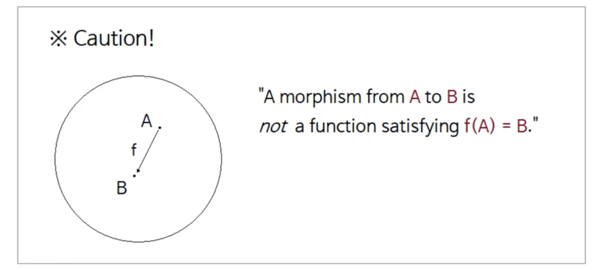
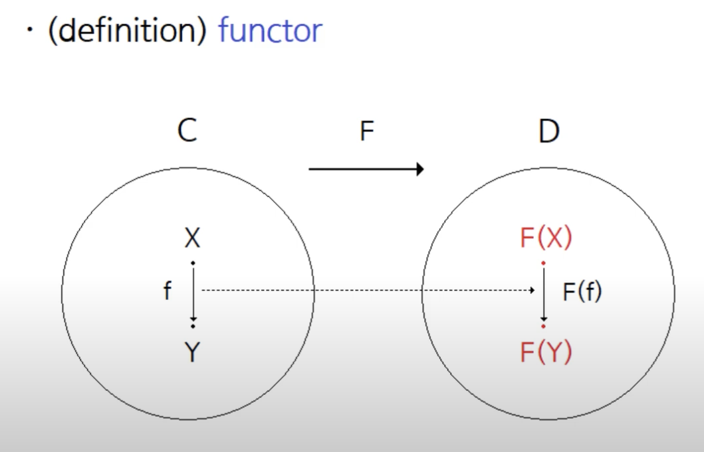

## 함수형 프로그래밍

### 재귀 호출

### Parameter Passing
1) Pass by value : 각 매개변수의 연산을 끝낸 후 값이 함수로 실행되어짐 -> eager eval이라고도 하는데, 연산을 할 수 있을 때 다해버리므로 많은 제약으로 인해 까다로운 언어가 된다.
2) Pass by name : 이름을 그대로 넘겨주는 방식
3) Pass by need : 필요에 의해서 매개변수의 전달이 이루어짐, 파라미터가 쓰일 때 eval을 하고, 그 다음부터는 값을 직접 이용한다.

### 느긋한 계산, 적극적 계산

- Evaluation은 compiler가 코드를 보고 결과를 평가하는 과정(함수를 실행하는 과정)
```
def func(x, y):
    return x + 1
func(3, 3 + 2)
```
- 위 예제에서 내부에서 쓰이지 않는 두번째 매개변수를 평가할 필요가 없다.
- 필요한 상황에서 함수의 실행(평가)을 하는 것을 lazy evaluation
- 즉시 평가하는 것을 (eager)strict evaluation이라고 하는데, 할당되자마자 연산을 시작한다.
- 기본적으로 자바는 eager evaluation을 사용한다.
- 자바 8에서는 일부 lazy evaluation 사용, Stream
- Supplier는 Lazy Evaluation을 지원한다.

### lazy compiler를 효율적으로 쓸 수 있는 방법
- memoization
한 번 evaluated된 값을 저장하여 재평가하지 않는 방법으로 dictionary key에는 변수이름, value는 평가 결과를 저장하여 계산된 변수를 dictionary에서 바로 사용하여 성능 향상
- 무한 자료 구조
재귀적으로 무한으로 list를 생성하는 재
```agsl
def addOne(n):
    [n] + addOne(n + 1)

list = addOne(1) // [1, 2, 3, 4, 5, 6, …]
```
lazy evaluation의 경우 재귀의 모든 depth가 아닌 현재 실행되는 depth만 평가하므로, 메모리 문제가 발생하지 않는다.
ex) 삼항 연산자의 경우 앞의 항을 평가한 후 필요할 경우에만 뒤의 항을 평가한다.

functional Interface의 get이 호출될 때 메소드가 실행된다.

### 모나드
모나드는 카테고리 이론, 범주론이라 불리는 수학의 한 분야에서 만들어진 개념
수학적 모나드를 배워 모든 프로그래밍 언어에 녹아있는 구조를 파악

- 카테고리 이론이란?
  - 집합과 유사한 개념으로, element 뿐만 아니라, 원소간의 관계까지 포함하는 개념
- 카테고리의 정의
  - 대상(Object, 점으로 표현)
  - 사상(Morphism, 화살표로 표현) : 대상들 사이에 관계에 대한 정보
    - 두 대상 사이에 몇 개든 존재 가능
- 카테고리의 조건
  1. 합성이 가능해야 한다.
    - f,g는 반드시 존재해야 하며, f->g 경로를 거친 것과 구분 불가해야한다.
    - 결합법칙이 성립해야한다. (h*(f*g)) = (h*f)*g
    - 임의의 두 사상에 대해 둘을 합성한 사상이 반드시 존재해야 한다.
  2. 모든 사상은 자신으로가는 항등 사상이 있어야한다.
  - 항등 사상과 다른 사상(f)의 합성은 f와 같은 사상이여야 합니다.

카테고리는 자연을 그대로 추상화한 것이 아니다.
자연을 분석할 때 사용하는 추상화한 개념들이 이루는 체계를 추상화한 것.
많은 것들을 합성 관계를 통해 분석하고, 분석을 통해 생성되는 카테고리에 대한 이론

즉, 카테고리는 수학의 여러 다른 분과에서 찾아지는 공통적인 구조를 찾기 위한 메타수학이론
- 달라야할 분야들이 공유하는 공통된 구조, 대상/대상 간의 합성 가능한 관계가 존재
- 수학적 구조로 만들어 연구하여 여러 분야에 적용할 수 있는 정리

### 사상 (morphism)
수학 - 선형대수학, 미분기하학, 위상수학, 집합론 등
수학의 분야마다 다루는 대상이 다 다르다. 수학적 구조(공리계)가 다르다.

사상(map)이 등장, 수학적인 구조를 반영한 함수를 사상이라고 한다.
값이 대응되는 함수의 개념이 아닌 광의의 개념.
구조를 유조시키는 함수, 사상 - morphism
ex) 미분기하학에서 다루는 함수는 미분구조를 따르는 함수여야한다.

### 프로그래밍에서 카테고리 이론을 사용하는 이유
프로그래밍 언어 사이에 나타나는 공통적인 개념, 관계가 카테고리 조건에 들어맞음
- 모든 프로그래밍 언어에는 타입이 존재
- 타입 간에는 합성 가능한 관계(함수, 사상)이 존재
- 카테고리 중 모든 집합을 대상으로, 집합 간의 모든 함수를 사상으로 하는 set이라는 카테고리가 의미있음.


- 모든 집합을 대상으로 > 모든 타입을 대상으로
- 집합 간의 모든 함수를 사상으로 > 타입 간의 함수를 사상으로

### Functor(함자)

정의 : 카테고리 간 대응시킬 수 있는 수단(사상), 집합 사이는 함수, 카테고리 간에는 함자

함자는 한 카테고리의 대상과 사상을 다른 카테고리의 대상과 사상에 대응시키는 관계
이 대응은 대상과 사상 간에 관계를 보존


### Endofunctor(자기 함자)
가장 중요한 함자는 정의역과 공역이 같은 카테고리 C에서 C로 가는 함자
이를 endofunctor라고 정의한다.

### Monad(모나드)

모나드는 연산을 정의하고, 추상화하기 위해 쓰이는 것
ex) Generic Programming - 데이터 타입에 대한 추상화로 재사용성을 끌어올림
마찬가지로 모나드는, 연산의 추상화를 통해 연산의 합성을 보장
모나드는 합칠수 있는 연산을 정의하고 추상화하기 위해 사용한다.
-> 모나드로 정의되는 서브루틴들을 합쳐질 수 있다.

모나드의 겉뜻: 어떤 타입 M에 대해 두 함수, pure과 compose가 존재할 때, M은 모나드이다.
모나드의 속뜻: 어떤 것이 모나드임이 시사하는 바는 그것이 합성될 수 있는 연산이라는 점이다.
모나드: 모나드란, 합성할 수 있는 연산이다.

‘모나드는 값을 캡슐화하고, 추가 기능을 더해 새로운 타입을 생성하는 구조체’

프로그래밍적으로 다음 세가지를 충족하면 모나드라 할 수 있다.
타입을 인자로 받는 타입이다.
unit(return) operator가 있어야 한다.
bind operator가 있어야 한다.

## 함수형 코드로 구현하기

1. SquadSet
- [O] 불변 타입으로 초기화할 때만 배열로 값을 넘길 수 있다. 추가나 삭제는 되지 않는다.
- [O] 수학에서 집합 개념을 지원하여, 요소가 중복되서는 안된다.
- [O] sum(other) : SquadSet에 다른other SquadSet 요소들을 더해서 합집합을 리턴한다. 이미 같은 값이 있으면 추가하지 않는다.
- [O] complement(other) : SquadSet에서 다른other SquadSet 요소를 빼서 차집합을 리턴한다. 값이 포함되어 있지 않으면 아무런 변화도 없다.
- [O] intersect(other) : SquadSet와 다른other SquadSet 값과 비교해서, 두 집합에 모두 있는 원소 - 교집합을 리턴한다.
- [O] resultAll() : 모든 요소를 1차원 배열로 리턴한다.

2. CountSet
- [O] 불변 타입으로 초기화할 때 Object 또는 HashMap으로 값을 넘길 수 있다.
- [O] 새로운 요소를 추가하거나 삭제하면 새로운 CountSet를 리턴한다.
- [O] SquadSet과 달리 요소가 중복해서 있을 수 있고, 요소별 Count 값을 가지고 있다.
- [O] append(element) : 새로운 요소를 추가하고 새로운 CountSet을 리턴한다. 이미 있는 경우는 Count만 증가하고 리턴한다.
- [O] remove(element) : 기존에 요소가 있으면 Count를 줄인다. 만약 0이되면 제거한 CountSet을 리턴한다.
  - 요소가 없는 경우
  - 요소가 있는데 Count가 1 : filter
  - 요소가 있는데 Count가 2 이상
- [O] countFor(element) : 특정 요소에 대한 Count 값을 리턴한다.
- [O] sum(other) : CountSet에 다른other CountSet 요소들을 더해서 합집합을 리턴한다. 이미 같은 값이 있으면 합쳐서 카운트를 올린다.
- [O] complement(other) : CountSet에서 다른other CountSet 요소를 빼서 차집합을 리턴한다. 값이 포함되어 있지 않으면 아무런 변화도 없다. 만약 현재 CountSet보다 빼려는 other CountSet 요소 Count가 더 큰 경우는 제거한다. (Count는 마이너스가 되지 않고 0보다 같거나 작으면 제거한다.)
- [O] intersect(other) : Set와 다른other CountSet 값과 비교해서, 두 집합에 모두 있는 원소 - 교집합을 리턴한다. 교집합 Count는 모두 1로 리턴한다.
- [O] resultAll() : 모든 요소와 Count를 Object 형태로 리턴한다.

### 프로그래밍 요구사항
- [O] 합을 구현할 때 Array 혹은 List 배열만 사용하며, Object, HashMap이나 기존에 구현된 Set, HashSet 등 라이브러리는 사용할 수 없다.
- [O] 핵심 로직 대신 입력이나 출력용으로 Object나 Map 구조로 값을 전달하는 것은 가능하다.
- [O] 반드시 O(1) 시간복잡도를 지원하지 않아도 되지만, 성능에 대해서 최선의 방식을 스스로 정한다.
- [O] 지원하는 타입은 정수형 또는 문자열을 기준으로 스스로 정한다.
- [O] 구현한 함수 기능을 모두 확인할 수 있는 동작 확인용 프로그램을 별도로 작성한다.
- [O] 각 클래스는 불변 클래스로 내부 속성을 바꾸지 않고, 변경될 경우는 새로운 집합을 리턴한다.

```

SquadSet
---------------------
제곱 , 짝수 인덱스, 스트링 변환 고차함수 실행
4, 16, 36, 64
교집합
[2]
차집합 
[1, 3]
합집합
[1, 2, 3]
원소 출력
1
2
3

CountSet
------------------
제곱 출력
1 : 2 , 4 : 2 , 9 : 2
짝수 출력
2 : 2
단독 출력
1 : 2 , 2 : 2 , 3 : 2
append
1 : 2 , 2 : 2 , 3 : 3
1 : 2 , 2 : 2 , 3 : 2 , 4 : 1
remove
3 : 3
1 : 1 , 3 : 2
COUNT 3
A 합집합 B
1 : 3 , 2 : 2 , 3 : 5
A 차집합 B
1 : 1 , 2 : 2
A 교집합 B
1 : 1 , 3 : 1

```
