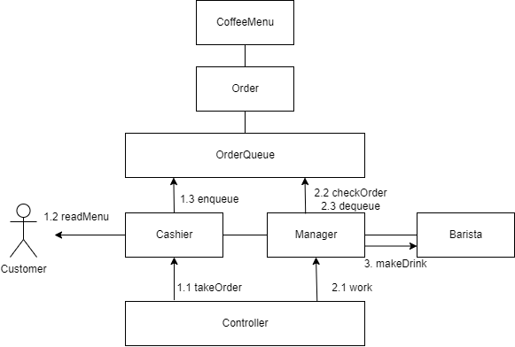

## 학습 내용 정리

# 4. Process Synchronization

- 데이터의 접근 - 연산 - 결과 저장 과정에 일어나는 순서에 따른 발생할 수 있는 문제
- Storage box를 여러 개의 execution box가 공유하기 때문에 발생할 수 있는 문제
- Race Condition
    - 여러 주체가 동시에 하나의 객체에 접근하려고 할 때 원치않는 결과를 얻을 수 있다.
    - CPU - Memory
        - Multi Processor System
    - 컴퓨터 내부 - 보조저장장치(디스크)
    - 프로세스 - 프로세스의 주소 공간
        - 일반적으로 프로세스는 자신의 주소 공간을 가지므로 문제가 되지 않는다.
        - 시스템콜을 통해 공유 메모리를 사용하는 프로세스의 경우
            - 커널 내부 데이터를 접근하는 루틴들 간
            - ex) 커널모드 수행 중 인터럽트로 커널모드 다른 루틴 수행 시

## OS에서 Race Condition은 언제 발생하는가?

- Interrupt Handler와 커널의 race
    - 수행하는 것이 둘다 커널 코드이므로 kernel address space 공유
    - Interrupt Handler가 커널 내부의 변수를 조작하는 경우(아래 예시)
    - 최종적으로 Kernel이 Count에 Store하므로 Interrupt의 조작은 반영이 안됨
    - 해결 : 인터럽트를 처리하지 않고 조작이 끝난 후에 인터럽트를 처리
- 시스템콜을 통해 커널 모드에서 수행 중에 context switch가 발생한 경우
    - 해결 : 커널 모드에서 수행 중일때는 CPU를 preempt하지 않음, 커널 모드에서 사용자 모드로 돌아갈 때 preempt
- Multi Processor
    - 어떤 CPU가 마지막으로 변수를 store했는가?
    - 방법 1) 데이터를 접근할 때 데이터에 대한 lock(접근) / unlock(저장)을 하는 방법
    - 방법 2) 한번에 하나의 CPU만이 커널에 들어갈 수 있게 하는 방법

## Process Synchronization 문제

- 공유 데이터의 동시 접근은 데이터의 불일치 문제를 일으킬 수 있다.
- 일관성 유지를 위해서는 협력 프로세스 간의 실행 순서를 정해주는 메커니즘이 필요
- Race Condition
    - 여러 프로세스들이 동시에 공유 데이터를 접근하는 상황
    - 데이터의 최종 연산 결과는 마지막에 그 데이터를 다룬 프로세스에 따라 달라짐
- Race Condition을 막기 위해 동시 접근 프로세스는 동기화가 되어야한다.

## The Critical-Section Problem

- n개의 프로세스가 공유 데이터를 동시에 사용하기를 원하는 경우
- 각  프로세스의 code segment는 공유 데이터를 접근하는 critical section이 존재
- Problem
    - 하나의 프로세스가 Critical section에 있을 때, 다른 모든 프로세스는 critical section에 들어갈 수 없어야 한다.

## 프로그램적 해결법의 충족 조건

- Mutex(상호 배제)

한 프로세스가 Critical Section 부분을 수행 중이면 다른 모든 프로세스들은 그들의 critical section에 들어가면 안된다.

- Progress(진행)

아무도 Critical Section에 있지 않은 상태에서 critical section에 들어가고자 하는 프로세스가 있으면 critical section에 들어가게 해주어야 한다.

- Bounded Waiting(유한 대기)

프로세스가 critical section에 들어가려고 요청한 후부터 그 요청이 허용될 때까지 다른 프로세스들이 critical section에 들어가는 횟수에 한계가 있어야 한다.

### Critical Section 문제 해결 - Synchronization 알고리즘

- Turn 변수를 이용하는 방법
    - Mutex를 만족
    - Progress 불만족

process에 들어가려는 빈도가 다를 수 있기 때문에, progress 조건을 만족시키지 않는다.

- Flag를 이용하는 방법
    - Mutex를 만족
    - Progress 불만족
    - Bounded Waiting 불만족

크리티컬 섹션에 들어가고자 할 때, 플래그를 true로 바꾸고 상대방의 플래그가 있는지를 확인하고 기다린다. 둘 다 2행까지 수행 후 서로 양보하는 상황 발생 가능

- 피터슨의 알고리즘 - 턴과 플래그를 모두 사용
    - 모든 조건을 만족

상대방의 차례이고, 상대방이 임계 영역에 들어가려는 의사가 있는 경우에만 상대를 기다린다.

- Busy Waiting(Spin Lock)  - 계속 CPU와 메모리를 사용하면서 기다린다.
    - 즉, 상대방이 CPU를 사용해야 Waiting이 끝나는데도 while 조건을 검사하면서 CPU를 낭비하는 상황

Synchronization Hardware

- 하드웨어적으로 Test&modify를 atomic하게 수행할 수 있도록 지원하는 경우 앞의 문제가 간단히 해결 (read & assign을 하나의 instruction으로 지원하는 경우)

## Semaphores

- 앞의 방식들을 추상화시킨 추상 자료형
- Integer variable(자원의 개수)
- 아래 두가지 **atomic 연산**으로만 접근 가능
    - atomic 연산에 대한 전제
- P(S) : 공유 데이터를 획득하는 과정
- V(S) : 공유 데이터를 반납하는 과정

**Semaphore의 구현 방법**

1. Busy Waiting (=spin lock)
2. Block & Wakeup (=sleep lock)

## **Block / Wakeup Implementation**

- 세마포어를 값과 process wait queue의 구조체로 정의
- 세마포어의 큐를 PCB의 큐로 구현
- 자원을 반납할 때, 기다리는 프로세스를 깨워줘야한다.

- S가 자원의 개수의 의미와는 다르다.
- S가 음수면 다른 프로세스가 자원을 기다리고 있다는 의미.
- 양수는 여분이 있기 때문에 깨울 필요가 없다.

- Busy-wait vs block/wakeup
    - 일반적으로 block/wakeup이 효율적이다.
    - Block/wakeup도 overhead가 발생한다.
    - Critical section 길이가 짧은 경우 Black/wakeup 오버 헤드가 더 커질 수 있다.


**Two Types of Semaphores**

- Counting semaphore

도메인이 0 이상인 임의 정수 값

주로 resource counting에 사용

- Binary semaphore(=mutex)

0 또는 1 값만 가질 수 있는 semaphore

주로 mutual exclusion(on/off)에 사용

### Deadlock and Starvation

- Deadlock : 둘 이상의 프로세스가 서로 상대방에 의해 충족될 수 있는 event를 무한히 기다리는 현상
    - 자원을 획득하는 순서를 정해준다면 해결 가능, Q를 얻기위해서는 S를 얻어야하도록 만듦
- Starvation : Indefinite blocking - 프로세스가 suspend된 이유에 해당하는 세마포어 큐에서 빠져나갈 수 없는 현상

## Bounded-Buffer Problem(Producer-Consumer)

Producer : buffer에 데이터를 집어넣는 역할

Consumer : buffer의 데이터를 사용하는 역할

Synchronization 변수들

1. mutex → binary semaphore 필요
2. buffer의 유한함 → 생산/소비의 불균형 발생 시 buffer 부족 발생 가능 → Need integer semaphore(남은 full/empty buffer 수 표시)

## Readers-Writers Problem

- 한 프로세스가 DB에 write 중일 때 다른 프로세스가 접근하면 안됨
- read는 동시에 여럿이 해도 됨
- Writer가 db에 접근 허가를 아직 얻지 못한 상태에서는 모든 대기중인 reader들을 다 DB에 접근하게 해준다.
- Writer는 대기 중인 reader가 없을 때 DB 접근이 허용된다.
- 일단 Writer가 DB에 접근 중이면 Reader는 접근 금지된다.
- Writer가 DB에서 빠져나가야만 Reader의 접근이 허용된다.

공유변수

- mutex : readcount도 공유변수이므로 공유 변수를 조작 시 mutual exclusion 보장을 위해 lock이 필요
- db : write와 reader를 분리하기 위한 lock 변수
- reader는 일단 reader가 들어오면 계속 접근할 수 있기 때문에 계속 reader가 들어온다면 writer가 starvation 될 수 있다.

## Dining-Philosophers Problem

- 문제점
    - Deadlock 가능성이 있다.
    - 모든 철학자가 동시에 왼쪽 젓가락을 집은 경우
    - Starvation
        - 양쪽 철학자가 번갈아가면서 젓가락을 집는 경우

- 해결 방법
    - 4명의 철학자만이 테이블에 동시에 앉을 수 있도록 한다.
    - 젓가락을 두 개 모두 집을 수 있을 때에만 집을 수 있게 한다.
    - 비대칭
        - 짝수(홀수) 철학자는 왼쪽(오른쪽) 젓가락부터 집도록함

## Monitor

- Semaphore의 문제점
    - 코딩하기 힘들다
    - 정확성의 입증이 어렵다
    - 자발적 협력이 필요하다
    - 한번의 실수가 모든 시스템에 치명적 영향
- 동시 수행 중인 프로세스 사이에서 abstract data type의 안전한 공유를 보장하기 위한 high-level synchronization construct
- 공유 데이터는 모니터에 정의된 프로시저를 통해서만 접근 가능
- lock을 걸 필요가 없다.
- 자원의 개수를 세주는 세마포어처럼 condition variable이 존재

- Condition variable
    - 조건이 맞지 않아 프로세스를 잠들게 할 때 사용
    - wait - condition variable에 가서 줄서게 됨
    - signal - condition variable에서 잠든 프로세스를 깨운다.

## 학습거리 정리


### Blocking/Non-blocking, Sync/Async
Blocking : 자신의 작업을 진행하다가 다른 주체의 작업이 시작되면 다른 작업이 끝날 때까지 기다렸다가 자신의 작업을 시작하는 것
Non-Blocking : 다른 주체의 작업에 상관없이 자신의 작업을 하는 것

- 다른 주체가 작업할 때 자신 제어권이 있는지 없는지로 구분!

Synchronous : 동기, 작업을 동시에 수행하거나, 동시에 끝나거나, 끝나는 동시에 시작함을 의미
Asynchronous : 비동기, 시작, 종료가 일치하지 않고, 끝나는 동시에 시작하지 않음을 의미

- 결과를 돌려주었을 때 순서와 결과에 관심이 있는지 아닌지로 구분!

1. Blocking / Sync
   자바의 입력요청 - 입력요청 시 대기, 입력이 돌아오면 바로 다음 작업 수행

2. Non-Blocking / Sync
   주기적으로 수행이 완료되었는지 물어보는 경우
3. Blocking / Async

4. Non-Blocking / Async
   자신의 일이 끝나면 다른 작업의 일을 수행
   콜백을 통해 추가작업을 처리하는 경우

### 콜백함수
함수는 객체이다. 따라서 함수는 함수를 인자로 받고 다른 함수를 통해 반환될 수 있다. 인자로 대입되는 함수를 콜백함수라고 부른다.
동기 콜백 - 호출 즉시 실행
비동기 콜백 - 조건 만족 시 실행(timeOut 등)
### 콜백 지옥(Callback Hell)
비동기 처리에 콜백함수를 이용하게 되면 비동기 처리를 중첩시켜서 코드를 작성하기때문에 에러, 예외처리가 어렵고 중첩으로 인한 복잡도가 증가하게 된다.


### 멀티스레드, 비동기 병렬 처리
- 비동기란?
비동기, 시작, 종료가 일치하지 않고, 끝나는 동시에 시작하지 않음을 의미한다. 즉, 실행 순서를 보장받지 못한다는 것.
여러 개의 쓰레드를 통해서 병렬 처리를 하는 것을 비동기 병렬 처리라고 한다.

### 이벤트 루프
- 자바스크립트 엔진은 싱글 스레드지만 Web APIs는 멀티 스레딩으로 처리된다.
- 자바스크립트에서 호출스택과 콜백 큐를 계속 주시하고있다.
- 호출 스택이 비어있으면, 먼저 들어온 순서대로 콜백 큐에 있는 콜백 함수들을 호출 스택으로 집어넣는다.

### Thread Pool
ExecutorService es = Executors.newFixedThreadPool(개수);
-> 쓰레드 고정 개수를 선언하고 새로운 비동기 작업마다 새 쓰레드를 할당, 개수만큼 쓰고나면 남은 것 중에서 캐시하여 사용

### CompletableFuture
비동기 실행을 위한 Java5에서 추가되었던 Future의 한계점을 보완하여 외부에서도 작업 완료, 콜백 중첩이 가능한 CompletableFuture 클래스입니다. 간단히 말하면 라이브러리를 이용해서 비동기 실행을 간단하게 할 수 있습니다. 프로그래머가 해야할 것은 비동기로 실행할 부분을 비동기 실행 메서드 안에 집어넣기만 하면됩니다. 위에서 언급한 비동기 실행을 위한 스레드도 ForkJoinPool의 CommonPool() 스레드 풀에서 새로운 비동기 작업이 발생할 때마다 할당하는 방식으로 진행되는데, Executors를 사용하면 스레드 개수를 원하는대로 변경할 수도 있습니다.

- 작업 실행
 - runAsync
   - 반환값이 없는 경우, 비동기로 작업 실행 콜
 - supplyAsync
   - 반환값이 있는 경우, 비동기로 작업 실행 콜
- 작업 콜백(이후 수행)
  - thenApply
    - 반환 값을 받아서 다른 값을 반환
    - 함수형 인터페이스 Function을 파라미터로 받음
  - thenAccept
    - 반환 값을 받아 처리하는 Consumer Type
    - 함수형 인터페이스 Consumer를 파라미터로 받음
  - thenRun
    - 반환 값을 받지 않고 다른 작업을 실행하는 Supplier Type
    - 함수형 인터페이스 Runnable을 파라미터로 받음
- 예외 처리
  - exeptionally
    - 발생한 에러를 받아서 예외를 처리
    - 함수형 인터페이스 Function을 파라미터로 받음
  - handle, handleAsync
    - (결과값, 에러)를 반환받아 에러가 발생한 경우와 아닌 경우 모두를 처리할 수 있음
    - 함수형 인터페이스 BiFunction을 파라미터로 받음

## 기능요구사항
- [O] 콘솔에서 동작하는 프로그램을 작성한다.
- [O] 지금까지 미션들에서 학습했던 다양한 패턴, 응용 방식을 활용해서 비동기로 동작하도록 작업한다.
- [O] 다음 요구사항에 나오는 구성 요소들을 객체나 모듈로 구분해서 구현한다.
- [O] 동기 함수들 보다 비동기 함수를 중심으로 구현한다.
주문부터 제작 완료까지 이벤트 흐름을 그림으로 그려서, 학습 저장소에 함께 첨부한다.

## 주문 이벤트 요구사항
- [O] 주문 담당자(Cashier)는 음료 주문을 연속해서 받을 수 있다.
- [O] 음료 주문을 받으면 주문 대기표(Queue)에 추가한다.
- [O] 주문 대기표도 이벤트를 받아서 처리하는 별도 모듈/객체로 분리해서 구현한다.
- [O] 매니저(Manager)는 음료를 확인하기 위해서 주문 대기표를 1초마다 확인한다.
- [O] 주문이 있을 경우 작업이 비어있는 (제작할 수 있는) 바리스타에게 작업 이벤트를 전달한다.
- [O] 바리스타가 보낸 특정 고객의 음료 제작 완료 이벤트를 받으면 결과를 출력한다.
- [O] 바리스타(Barista)는 동시에 2개까지 음료를 만들 수 있다고 가정한다.
- [O] 스레드를 직접 생성하는 게 아니라 이벤트 방식으로 동작해야 한다.
- [O] 바리스타는 음료를 만들기 시작할 때와 끝날 때 마다 이벤트를 발생한다.
- [O] 이벤트가 발생할 때마다 음료 작업에 대한 로그를 출력한다. 
- [O] 주문 담당자, 매니저, 바리스타가 한 명(인스턴스가 한 개)만 있다고 가정한다

## 커뮤니케이션 다이어그램 



### 구현 결과

```
> 주문할 음료를 입력하세요. 예) 아메리카노 2개 => 1:2
1:3
/1,1,1/
> 메뉴  =  1. 아메리카노(3s)    2. 카페라떼(5s)    3. 프라프치노(10s)
> 주문할 음료를 입력하세요. 예) 아메리카노 2개 => 1:2
/1,1/
아메리카노 시작
/1/
아메리카노 시작
2:2
/1,2,2/
> 메뉴  =  1. 아메리카노(3s)    2. 카페라떼(5s)    3. 프라프치노(10s)
> 주문할 음료를 입력하세요. 예) 아메리카노 2개 => 1:2
아메리카노 완성
아메리카노 완성
아메리카노 시작
/2,2/
/2/
카페라떼 시작
아메리카노 완성
/
카페라떼 시작
카페라떼 완성
카페라떼 완성
모든 음료를 제조했습니다.

Process finished with exit code 0
```
